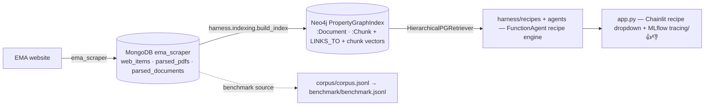

# ema_nlp

A Q&A benchmark and reference RAG implementations built from European Medicines Agency (EMA) human-regulatory content.

**Goal:** build a shareable benchmark from EMA Q&A documents and measure where expert effort actually pays off in agentic RAG pipelines — corpus quality, retrieval filtering, agent planning, and prompting strategy.

> **Retrieval runs on Neo4j.** All ~80,000 EMA documents are chunked, embedded, and stored
> as a hierarchical LlamaIndex `PropertyGraphIndex` in Neo4j; the recipe engine and the chat
> UI read from it. See **[docs/RETRIEVAL.md](docs/RETRIEVAL.md)**.[^refactor]

## Deliverables

| Artifact | Description |
|----------|-------------|
| `corpus/corpus.jsonl` | Normalized Q&A pairs extracted from EMA HTML accordions and PDFs (benchmark source; not the retrieval target) |
| `benchmark/benchmark.jsonl` | 45 evaluation questions stratified across four types (T1–T4) with gold answers |
| `harness/indexing/` | LlamaIndex-first retrieval pipeline (Neo4j PropertyGraphIndex) |
| `harness/recipes/` | Config-driven **recipe engine** — one `FunctionAgent` configured per recipe (naive RAG, CRAG, ReAct as tools + prompt) |
| `harness/{agents,tools}/` | The single agent engine + its tool registry (`ema_search`, `corrective_search`, `resolve_substance`) |

## Quick links

**Start here: [Onboarding →](docs/ONBOARDING.md)** — the big picture, the mental model,
"life of a question", and where everything lives.

**What's open right now: [BACKLOG.md →](BACKLOG.md)** — the single ranked queue of open
work (`Now` capped at 3), what's parked and why, and the open questions awaiting a
decision. Phase-level status lives in [the roadmap](project_roadmap/ROADMAP.md); the
backlog is what's current.

Then, in reading order:

- **[Recipes →](docs/RECIPES.md)** — configure pipelines via YAML, with worked examples (simple RAG, reproducing the CRAG paper, the kitchen sink)
- **[Examples (notebooks) →](docs/examples/README.md)** — runnable Jupyter notebooks that drive the pipeline headless, one concept at a time
- **[Retrieval →](docs/RETRIEVAL.md)** — Neo4j PropertyGraphIndex: node/graph model, config profiles, build + retrieve
- **[Tools & retrieval reference →](docs/tools/README.md)** — one file per agent tool (`ema_search`, `corrective_search`, `topic_context`, `resolve_substance`) plus the retriever, the site tree, and chain capture/export
- **[Citations →](docs/CITATIONS.md)** — claim-span attribution, the SME review panel, per-citation feedback, Markdown/HTML export
- **[Architecture →](docs/ARCHITECTURE.md)** — module map, data flow, MongoDB collections
- **[Runtime verification →](docs/RUNTIME_VERIFICATION.md)** — the GPU-host walk (§8 = the current next step)
- **[Setup guide →](docs/SETUP.md)** — install dependencies, configure credentials, start services
- **[Decisions →](DECISIONS.md)** / **[Open questions →](OPEN_QUESTIONS.md)** — what was decided (with rationale) and what isn't yet
- **[Roadmap →](project_roadmap/ROADMAP.md)** — full phase-by-phase plan
- **[Glossary →](project_roadmap/GLOSSARY.md)** — EMA regulatory terminology (read before touching pharma acronyms; "AI" = Acceptable Intake)

## Current status

**In one line:** the system works end-to-end — ask a question in the chat and get a cited,
structured answer over ~80,000 EMA documents. What is still missing is the *benchmark
result*: the closed-book baseline and the **lift** metric that turn "it works" into "here
are the numbers".

| Phase | Status | Where it stands |
|---|---|---|
| 1 · Corpus | ✅ done | `corpus/corpus.jsonl` — 26,251 Q&A pairs (17,505 HTML accordion + 8,746 PDF) |
| 2 · Benchmark | 🟡 drafted | `benchmark/benchmark.jsonl` — 45 questions (20 T1 / 10 T2 / 10 T3 / 5 T4); the contamination screen is still to do |
| 3 · Retrieval + eval | 🟡 partial | retrieval, the answering engine, and the eval runner are live and MLflow-traced; the closed-book baseline + lift metric are the next build |
| 4 · Ablations | ◻ planned | methodology is fixed; the agent for Ablation B already exists |

**How answering works.** There is one engine: a LlamaIndex `FunctionAgent`. A **recipe** — a
single YAML file — configures it: system prompt, tools, retrieval, model. Different RAG
techniques are different recipes, not different code. Naive RAG is the agent with one
`ema_search` tool; CRAG adds a `corrective_search` tool (a bounded grade-and-rewrite loop);
ReAct is the agent's own tool loop. Answers are structured (a `RegulatoryAnswer`) and carry
clickable `[n]` citations, an SME review panel, and Markdown/HTML export. Every turn is one
MLflow trace, stamped with the exact recipe that produced it.[^engine]

See `docs/next/` for what gets built next, and `.claude/work/` for work-unit logs.

## Stack

| Layer | Choice |
|-------|--------|
| Retrieval framework | LlamaIndex (`PropertyGraphIndex`, custom `BaseRetriever`) |
| Index + vector store | **Neo4j** — `Neo4jPropertyGraphStore` (graph) + native vector index over chunk embeddings |
| Orchestration | Config-driven recipe engine over one LlamaIndex `FunctionAgent` (techniques = tools + prompt) |
| Chat UI | Chainlit 2.11 — streaming answers, source sidebar, 👍/👎 |
| Embeddings | BGE-large-en-v1.5 via sentence-transformers (local CUDA, no API key) |
| Tracing | MLflow — `llama_index.autolog()` + an explicit per-turn span (self-hosted, sqlite-backed; UI on :5000) |
| Feedback | MLflow trace assessments (`log_feedback`) via Chainlit 👍/👎 |
| LLM | Anthropic Claude (primary); OLMo 3 (contamination-verifiable reference) |
| Data | MongoDB (raw scrape + parsed text) → Neo4j (graph + vectors); JSONL (corpus/benchmark) |

## Data sources

| Store | Collection | Contents | Count |
|-------|-----------|----------|-------|
| MongoDB `ema_scraper` | `web_items` | Raw scraped pages — HTML (`html_raw`) + PDF metadata; `url` is a 1-element list | 115k |
| MongoDB `ema_scraper` | `parsed_pdfs` | Parsed PDF markdown keyed by URL (`_id`) | 65k |
| MongoDB `ema_scraper` | `parsed_documents` | Canonical parser output (`url, parser, content_type, text`) — the ingestion source | ~80k¹ |
| Neo4j | `:Document` / `:Chunk` + edges | Retrieval graph + chunk vector index | 79,882 docs |

¹ `parsed_documents` holds the full ~80k-doc canonical parser output; the Neo4j PropertyGraphIndex (79,882 `:Document` nodes) was built from it. See [docs/RETRIEVAL.md](docs/RETRIEVAL.md).

Scraped content comes from the companion repo [ema_scraper](https://github.com/MoritzImendoerffer/ema_scraper). Services (Mongo + Neo4j) are provisioned via Docker Compose under `deploy/` and started by `scripts/start_services.sh`.

## Data flow

See **[docs/ARCHITECTURE.md](docs/ARCHITECTURE.md)** for the detailed flow and **[docs/RETRIEVAL.md](docs/RETRIEVAL.md)** for the retrieval internals.

## License

Code: MIT. Corpus and benchmark data: CC-BY-4.0 (EMA content reproduced under EMA terms; cite both this repo and EMA).

[^refactor]: The Neo4j store replaced an earlier Postgres + pgvector store and a still-earlier FAISS index over `corpus.jsonl`, both now deleted. Pre-refactor state is preserved on `main` and `archive/pre-llamaindex-refactor`; the change is tracked in work unit [`2026-05-30_20_llamaindex-retrieval-refactor`](.claude/work/2026-05-30_20_llamaindex-retrieval-refactor/state.json).

[^engine]: The agent is the only engine (branch `claude/agentic-rag-foundation`). It replaced a 7-workflow engine (deleted 2026-06-25) and Arize Phoenix tracing (removed 2026-06-22, in favour of MLflow). The eval runner was rebuilt on 2026-07-04 and first ran live on 2026-07-13. Full detail: [docs/RECIPES.md](docs/RECIPES.md), [docs/RAG_TECHNIQUES.md](docs/RAG_TECHNIQUES.md), [docs/TARGET_ARCHITECTURE.md](docs/TARGET_ARCHITECTURE.md).
