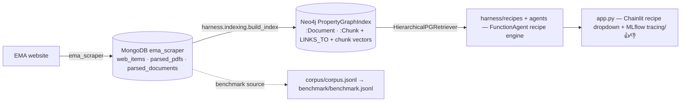

# ema_nlp

A Q&A benchmark and reference RAG implementations built from European Medicines Agency (EMA) human-regulatory content.

**Goal:** Build a shareable benchmark from EMA Q&A documents and measure where expert effort actually pays off in agentic RAG pipelines — corpus quality, retrieval filtering, agent planning, and prompting strategy.

> ✅ **Retrieval refactor complete** (branch `refactor/llamaindex-retrieval-pipeline`).
> The retrieval layer was rebuilt **LlamaIndex-first**: a hierarchical
> `PropertyGraphIndex` on **Neo4j** replaced the former Postgres + pgvector and FAISS
> paths, which are now deleted. The full graph is built (79,882 docs) and the
> recipe engine + chat UI consume the retriever.
> See **[docs/RETRIEVAL.md](docs/RETRIEVAL.md)** and the work unit
> [`2026-05-30_20_llamaindex-retrieval-refactor`](.claude/work/2026-05-30_20_llamaindex-retrieval-refactor/state.json).
> Pre-refactor state is preserved on `main` and `archive/pre-llamaindex-refactor`.

## Deliverables

| Artifact | Description |
|----------|-------------|
| `corpus/corpus.jsonl` | Normalized Q&A pairs extracted from EMA HTML accordions and PDFs (benchmark source; not the retrieval target) |
| `benchmark/benchmark.jsonl` | 45 evaluation questions stratified across four types (T1–T4) with gold answers |
| `harness/indexing/` | LlamaIndex-first retrieval pipeline (Neo4j PropertyGraphIndex) |
| `harness/recipes/` | Config-driven **recipe engine** — one `FunctionAgent` configured per recipe (naive RAG, CRAG, ReAct as tools + prompt) |
| `harness/{agents,tools}/` | The single agent engine + its tool registry (`ema_search`, `corrective_search`, `resolve_substance`) |

## Quick links

- **[Setup guide →](docs/SETUP.md)** — install dependencies, configure credentials, start services
- **[Architecture →](docs/ARCHITECTURE.md)** — data flow, MongoDB collections, corpus pipeline
- **[Retrieval →](docs/RETRIEVAL.md)** — Neo4j PropertyGraphIndex: node/graph model, config profiles, build + retrieve, mermaid flows
- **[Decisions →](DECISIONS.md)** — architectural and scope decisions with rationale
- **[Open questions →](OPEN_QUESTIONS.md)** — decisions not yet made
- **[Roadmap →](project_roadmap/ROADMAP.md)** — full phase-by-phase plan
- **[Glossary →](project_roadmap/GLOSSARY.md)** — EMA regulatory terminology (read before touching pharma acronyms)

## Current status

**Phase 1 — corpus extraction complete.** `corpus/corpus.jsonl`: 26,251 Q&A records (17,505 HTML accordion + 8,746 PDF). 65,263 parsed PDFs in MongoDB `parsed_pdfs`.

**Phase 2 — benchmark drafted.** `benchmark/benchmark.jsonl`: 45 items (20×T1, 10×T2, 10×T3, 5×T4).

**Retrieval refactor (complete).** Retrieval is LlamaIndex-first on Neo4j:
- ✅ `harness/indexing/` — config profiles + registry, hierarchical chunker, link extractor, Mongo→IR ingestion, Neo4j PropertyGraphIndex build + `HierarchicalPGRetriever` (small-to-big + `links_to`). 36 unit tests; built live over the full corpus (79,882 docs).
- ✅ The recipe engine + chat UI consume the retriever (LIR-009/010, workflows since retired); the old pgvector/FAISS stack is deleted (LIR-012).
- ✅ The **eval suite is rebuilt** (2026-07-04): `harness/eval/runner.py` + `scripts/run_eval.py` run a recipe over `benchmark/benchmark.jsonl` — one MLflow run per question type (T1–T4) with `mlflow.genai` judges. *(The pre-refactor suite remains archived on `archive/pre-llamaindex-refactor`; ablations + the lift metric are still TODO.)*

**Recipe engine — single-engine agentic RAG (branch `claude/agentic-rag-foundation`).** There is **one engine**: a LlamaIndex `FunctionAgent`. The UI/eval select a **recipe** (`harness/configs/recipes/*.yaml` + `$EMA_CONFIG_DIR`) = orchestration (system prompt + tools + output schema) + retrieval (index profile + optional pipeline + few-shot) + generation + an optional inline judge. RAG *techniques are tools + instructions* — Naive RAG → `ema_search`; **CRAG → `corrective_search`** (a bounded grade/rewrite loop); ReAct → the agent's tool loop. Structured `RegulatoryAnswer` output, MLflow autolog + `mlflow.genai` judges, and typed ontology enrichment live under `harness/{schemas,tools,agents,retrieval,recipes,obs,ontology,eval}/`. A single Chainlit **recipe dropdown** drives it; the resolved recipe is stamped honestly on every MLflow trace (Arize Phoenix was fully removed in the 2026-06-22 migration). **The legacy `harness/workflows/*` Workflow engine was retired (2026-06-25).** Start here: **[docs/RECIPES.md](docs/RECIPES.md)** + **[docs/RAG_TECHNIQUES.md](docs/RAG_TECHNIQUES.md)**; design in **[docs/TARGET_ARCHITECTURE.md](docs/TARGET_ARCHITECTURE.md)**.

See `.claude/work/` for work unit logs.

## Stack

| Layer | Choice |
|-------|--------|
| Retrieval framework | LlamaIndex (`PropertyGraphIndex`, custom `BaseRetriever`) |
| Index + vector store | **Neo4j** — `Neo4jPropertyGraphStore` (graph) + native vector index over chunk embeddings |
| Orchestration | Config-driven recipe engine over one LlamaIndex `FunctionAgent` (techniques = tools + prompt) |
| Chat UI | Chainlit 2.11 — streaming answers, source sidebar, 👍/👎 |
| Embeddings | BGE-large-en-v1.5 via sentence-transformers (local CUDA, no API key) |
| Tracing | MLflow — `llama_index.autolog()` + an explicit per-turn span (self-hosted, sqlite-backed; UI on :5000) |
| Feedback | MLflow trace assessments (`log_feedback`) via Chainlit 👍/👎 |
| LLM | Anthropic Claude (primary); OLMo 3 (contamination-verifiable reference) |
| Data | MongoDB (raw scrape + parsed text) → Neo4j (graph + vectors); JSONL (corpus/benchmark) |

## Data sources

| Store | Collection | Contents | Count |
|-------|-----------|----------|-------|
| MongoDB `ema_scraper` | `web_items` | Raw scraped pages — HTML (`html_raw`) + PDF metadata; `url` is a 1-element list | 115k |
| MongoDB `ema_scraper` | `parsed_pdfs` | Parsed PDF markdown keyed by URL (`_id`) | 65k |
| MongoDB `ema_scraper` | `parsed_documents` | Canonical parser output (`url, parser, content_type, text`) — the ingestion source | ~80k¹ |
| Neo4j | `:Document` / `:Chunk` + edges | Retrieval graph + chunk vector index | 79,882 docs |

¹ `parsed_documents` holds the full ~80k-doc canonical parser output; the Neo4j PropertyGraphIndex (79,882 `:Document` nodes) was built from it. See [docs/RETRIEVAL.md](docs/RETRIEVAL.md).

Scraped content comes from the companion repo [ema_scraper](https://github.com/MoritzImendoerffer/ema_scraper). Services (Mongo + Neo4j) are provisioned via Docker Compose under `deploy/` and started by `scripts/start_services.sh`.

## Data flow

See **[docs/ARCHITECTURE.md](docs/ARCHITECTURE.md)** for the detailed flow and **[docs/RETRIEVAL.md](docs/RETRIEVAL.md)** for the retrieval internals.

## License

Code: MIT. Corpus and benchmark data: CC-BY-4.0 (EMA content reproduced under EMA terms; cite both this repo and EMA).
