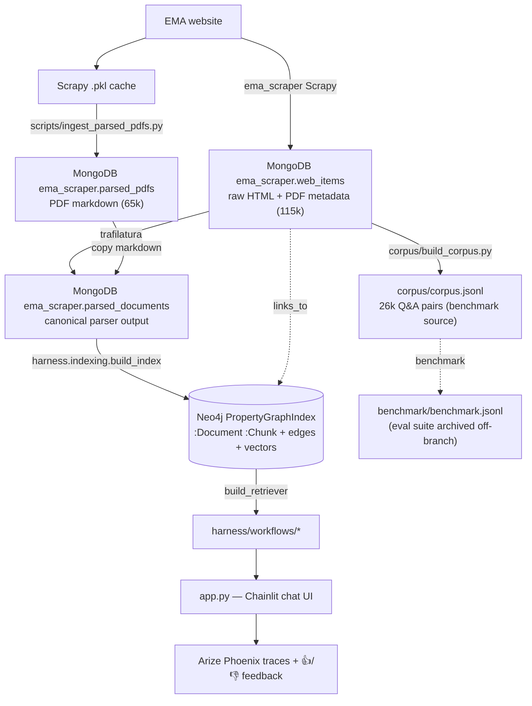

# Architecture and data guide

How the project stores, processes, and retrieves data — from raw scrape to chat answer.

> ✅ **Retrieval refactor landed.** Retrieval is LlamaIndex-first on **Neo4j**
> (hierarchical `PropertyGraphIndex`), replacing the former Postgres+pgvector and FAISS
> paths. The offline pipeline (`harness/indexing/`) is built and the full graph indexed;
> the workflow + chat-UI re-seam (LIR-009/010) and old-stack deletion (LIR-012) are
> **complete** — `harness/retrieve*.py`, `harness/embed*.py`, and `harness/pg/` are gone.
> See **[RETRIEVAL.md](RETRIEVAL.md)**.

---

## Data flow



Connections: `MONGO_URI` (default `mongodb://localhost:27017/`, db `ema_scraper`);
`NEO4J_URI` (default `bolt://localhost:7687`). Both start via
`scripts/start_services.sh` (Docker). Paths/credentials load from
`~/.myenvs/ema_nlp.env` via `config.py`.

---

## 1. MongoDB — raw + parsed data store

### `web_items` (115k)
Raw output of the [ema_scraper](https://github.com/MoritzImendoerffer/ema_scraper) spider.

| Field | Type | Notes |
|-------|------|-------|
| `url` | `[str]` | **1-element list**; full EMA URL |
| `content_type` | `[str]` | `["text/html"]` or `["application/pdf"]` |
| `html_raw` | `[str]` | HTML pages only (22,743 have it); the link source for `LINKS_TO` |

### `parsed_pdfs` (65k)
pymupdf4llm markdown from the Scrapy `.pkl` cache.

| Field | Type | Notes |
|-------|------|-------|
| `_id` / `url` | str | EMA PDF URL (lookup key) |
| `markdown` | str | parsed text (empty on failure) |
| `error` | str | `""` on success (query `{error: ""}`) |

### `parsed_documents` — ingestion source
Canonical parser output, one row per `(url, parser, parser_version)`:
`url, parser, parser_version, content_type, text, text_format, error`. Read by
`harness.indexing.ingest`.

> **Data note:** `parsed_documents` holds the full **~80,083-doc** parser output (backfilled
> into the `mongo:8.0.4` container), and the Neo4j PropertyGraphIndex (79,882 `:Document`)
> was built from it. The `link_graph` collection was **never built** — `LINKS_TO` edges are
> extracted at ingest from `web_items.html_raw`. For quick CPU iteration without the full
> set, seed a verify subset with `scripts/backfill_parsed_documents_subset.py`.

---

## 2. Corpus — `corpus/corpus.jsonl`

The curated, versioned **Q&A** dataset (26,251 records: 17,505 HTML accordion + 8,746
PDF). It is the **benchmark source**, not the retrieval target — retrieval is over the
narrative graph in Neo4j. Schema in [`corpus/SCHEMA.md`](../corpus/SCHEMA.md); rebuild
with `python corpus/build_corpus.py`. `corpus/mini_corpus.jsonl` is a 156-record dev subset.

---

## 3. Retrieval — Neo4j PropertyGraphIndex

Full operator's guide, node/graph model, config profiles, and mermaid flows are in
**[RETRIEVAL.md](RETRIEVAL.md)**. In brief: `harness.indexing.build_index(profile)` reads
`parsed_documents`, chunks hierarchically, extracts `links_to` from raw HTML, and writes
`:Document`/`:Chunk` nodes + edges + a chunk vector index into Neo4j;
`HierarchicalPGRetriever` serves vector hit + small-to-big + `links_to` expansion.
Selected by `EMA_INDEX_PROFILE` → `harness/configs/index/*.yaml`.

The live full graph holds 79,882 `:Document` and 7,435,393 `:Chunk` nodes (5,817,230
leaf chunks embedded), with `HAS_CHUNK`/`PARENT_OF` edges and **99,520 `LINKS_TO`** edges.
*(The `LINKS_TO` count was ~1.72M before the 2026-06-04 link-extraction upgrade scoped
extraction to the `main-content-wrapper`; any "1.72M" figure is stale.)*

---

## 4. LlamaIndex Workflow layer — `harness/workflows/`

LlamaIndex-native orchestration on top of retrieval. Every strategy is a typed,
event-driven `Workflow`. (LangChain/LangGraph are not in the stack.)

| Strategy | Description |
|----------|-------------|
| `simple_rag` | retrieve → generate (zero / few-shot / CoT via `prompt_strategy`) |
| `crag` | retrieve → grade ⇄ rewrite → generate |
| `summarize_rag` | retrieve → summarize → generate |
| `react` | `ReActNativeWorkflow` — per-step Phoenix spans; tools (`ema_search`, `filter_by_topic`) run on the injected retriever |
| `crag_summarize` / `crag_review` / `react_review` | composites |

`get_workflow(name, retriever=…, llm=…)` (in `harness/workflows/registry.py`) is the
single entry point; every builder takes the LlamaIndex retriever as a constructor argument
(LIR-009, done) and every runner exposes `.invoke()` / `.ainvoke()`. Model roles are in
`harness/configs/models.yaml` (`agent`/`grader`/`rewriter`/`reranker`/`judge`/`reviewer`).

---

### 4a. Agentic layer (in progress — branch `claude/agentic-rag-foundation`)

An additive LlamaIndex `FunctionAgent` orchestration is being built alongside the workflow
stack (the workflows above are untouched and remain what `app.py` runs):

| Package | Role |
|---------|------|
| `harness/schemas/` | Pydantic structured output (`RegulatoryAnswer` + `Claim`/`Citation`) |
| `harness/tools/` | `FunctionTool` registry (`ema_search`, `resolve_substance`) |
| `harness/agents/` | `build_agent` / `build_session` → `FunctionAgent` (config in `harness/configs/agent/`) |
| `harness/retrieval/` | config-driven pipeline (query transform + rerank) wrapping the retriever |
| `harness/obs/` | resolved-config trace stamping + MLflow run recording/tracing |
| `harness/ontology/` | typed entity/relation schema + `SchemaLLMPathExtractor` enrichment |
| `harness/eval/` | `mlflow.genai` judges + DSPy bootstrap (the reward/optimizer loop) |

Foundation is unit-tested offline; runtime wiring + verification are pending. Full design:
**[TARGET_ARCHITECTURE.md](TARGET_ARCHITECTURE.md)**.

---

## 5. Chat UI — `app.py` (Chainlit)

`bash run_ui.sh` (Phoenix + Chainlit). On session start it loads the index/retriever and
builds a per-session `WorkflowRunner`; per message it checks the semantic query cache,
optionally injects rated few-shot examples, runs the workflow, shows sources, and records
👍/👎 to Phoenix as span annotations. Tracing (Phoenix + OpenInference) and the feedback
stack (`query_cache.py`, `fewshot_inject.py`, `rating.py`) are **kept** through the refactor.

> **Refactor status (LIR-010 done, 2026-06-02):** `app.py` now loads the Neo4j
> `PropertyGraphIndex` via `EMA_INDEX_PROFILE` and builds a `HierarchicalPGRetriever`
> (the old `EMA_RETRIEVER` faiss/pgvector switch is removed); source cards render
> narrative-chunk snippets and citations key on node `source_url`. The full graph
> (79,882 docs) is built and live Phoenix tracing + 👍/👎 feedback run in `app.py` (LIR-011).

---

## 6. Evaluation harness — archived

The benchmark/eval suite (`run_eval.py`, `eval_retrieval.py`, ablations, eval configs) was
**removed from this branch** and preserved on `archive/pre-llamaindex-refactor`. It will be
rebuilt on the clean retrieval API in a later work unit. The methodology (T1–T4 types, lift,
contamination handling) is documented in `project_roadmap/{ROADMAP,ABLATIONS,LEAKAGE}.md`.
The chat-time faithfulness `Judge` (`harness/judge.py`) is **kept** (used by the `review`
workflows).

---

## 7. File storage layout

**In Git:** `corpus/build_corpus.py` + schemas, `benchmark/benchmark.jsonl`,
`harness/indexing/`, `harness/workflows/`, `harness/configs/`, `harness/prompts/`,
`deploy/{mongo,neo4j}/`.

**Local only (gitignored / derived):** `corpus/corpus.jsonl` (rebuild from Mongo); Neo4j
data (Docker volume `ema_neo4j_data`); `~/.cache/huggingface/` (BGE model); `results/`
(symlink to Nextcloud); `~/.myenvs/ema_nlp.env`.

**Nextcloud:** `~/Nextcloud/Datasets/ema_scraper/cache/` (Scrapy cache → `parsed_pdfs`),
`mongo_sync/` (Mongo dumps), IDMP ontology RDF.

---

## 8. Scripts reference

| Script | Purpose |
|--------|---------|
| `scripts/start_services.sh` | Start + health-check MongoDB + Neo4j (Docker) |
| `scripts/ingest_parsed_pdfs.py` | Bulk-upsert parsed PDF `.pkl` → `parsed_pdfs` |
| `scripts/backfill_parsed_documents_subset.py` | Seed a `parsed_documents` verify subset from legacy collections |
| `corpus/build_corpus.py` | Rebuild `corpus.jsonl` from MongoDB |
| `harness.indexing.build_index(profile)` (Python; see §9) | Build the Neo4j PropertyGraphIndex |
| `bash run_ui.sh` | Start Phoenix + Chainlit chat UI |

---

## 9. Common operations

```bash
# Start services (Mongo + Neo4j)
scripts/start_services.sh

# Seed a small parsed_documents subset (until full backfill on GPU)
python scripts/backfill_parsed_documents_subset.py --max-html 12 --max-pdf 30

# Build the index + verify retrieval (Python)
python - <<'PY'
from harness.indexing import load_index_profile, build_index, build_retriever
p = load_index_profile()
idx = build_index(p, reset=True)
r = build_retriever(p, idx)
print(len(r.retrieve("nitrosamine acceptable intake limit")))
PY

# Run the indexing unit tests (no infra)
pytest tests/test_indexing_*.py
```
