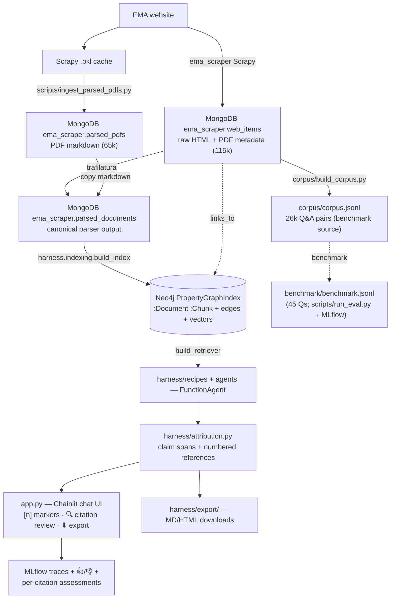

# Architecture and data guide

How the project stores, processes, and retrieves data — from raw scrape to chat answer.

> **Retrieval is LlamaIndex-first on Neo4j** — a hierarchical `PropertyGraphIndex` built by
> `harness/indexing/` over the full corpus. See **[RETRIEVAL.md](RETRIEVAL.md)**.[^refactor]

---

## Data flow



Connections: `MONGO_URI` (default `mongodb://localhost:27017/`, db `ema_scraper`);
`NEO4J_URI` (default `bolt://localhost:7687`). Both start via
`scripts/start_services.sh` (Docker). Paths/credentials load from
`~/Nextcloud/Datasets/ema_nlp/ema_nlp.env` via `config.py`.

---

## 1. MongoDB — raw + parsed data store

### `web_items` (115k)
Raw output of the [ema_scraper](https://github.com/MoritzImendoerffer/ema_scraper) spider.

| Field | Type | Notes |
|-------|------|-------|
| `url` | `[str]` | **1-element list**; full EMA URL |
| `content_type` | `[str]` | `["text/html"]` or `["application/pdf"]` |
| `html_raw` | `[str]` | HTML pages only (22,743 have it); the link source for `LINKS_TO` |

### `parsed_pdfs` (65k)
pymupdf4llm markdown from the Scrapy `.pkl` cache.

| Field | Type | Notes |
|-------|------|-------|
| `_id` / `url` | str | EMA PDF URL (lookup key) |
| `markdown` | str | parsed text (empty on failure) |
| `error` | str | `""` on success (query `{error: ""}`) |

### `parsed_documents` — ingestion source
Canonical parser output, one row per `(url, parser, parser_version)`:
`url, parser, parser_version, content_type, text, text_format, error`. Read by
`harness.indexing.ingest`.

> **Data note:** `parsed_documents` holds the full **~80,083-doc** parser output (backfilled
> into the `mongo:8.0.4` container), and the Neo4j PropertyGraphIndex (79,882 `:Document`)
> was built from it. The `link_graph` collection was **never built** — `LINKS_TO` edges are
> extracted at ingest from `web_items.html_raw`. For quick CPU iteration without the full
> set, seed a verify subset with `scripts/backfill_parsed_documents_subset.py`.

---

## 2. Corpus — `corpus/corpus.jsonl`

The curated, versioned **Q&A** dataset (26,251 records: 17,505 HTML accordion + 8,746
PDF). It is the **benchmark source**, not the retrieval target — retrieval is over the
narrative graph in Neo4j. Schema in [`corpus/SCHEMA.md`](../corpus/SCHEMA.md); rebuild
with `python corpus/build_corpus.py`. `corpus/mini_corpus.jsonl` is a 156-record dev subset.

---

## 3. Retrieval — Neo4j PropertyGraphIndex

Full operator's guide, node/graph model, config profiles, and mermaid flows are in
**[RETRIEVAL.md](RETRIEVAL.md)**. In brief: `harness.indexing.build_index(profile)` reads
`parsed_documents`, chunks hierarchically, extracts `links_to` from raw HTML, and writes
`:Document`/`:Chunk` nodes + edges + a chunk vector index into Neo4j;
`HierarchicalPGRetriever` serves vector hit + small-to-big + `links_to` expansion.
Selected by `EMA_INDEX_PROFILE` → `harness/configs/index/*.yaml`.

The live full graph holds 79,882 `:Document` and 7,435,393 `:Chunk` nodes (5,817,230
leaf chunks embedded), with `HAS_CHUNK`/`PARENT_OF` edges and **99,520 `LINKS_TO`** edges.
*(The `LINKS_TO` count was ~1.72M before the 2026-06-04 link-extraction upgrade scoped
extraction to the `main-content-wrapper`; any "1.72M" figure is stale.)*

---

## 4. Orchestration — the recipe engine (`harness/recipes/`, `harness/agents/`)

There is **one engine**: a LlamaIndex `FunctionAgent`. A *recipe*
(`harness/configs/recipes/*.yaml` + `$EMA_CONFIG_DIR`) configures it — system prompt +
tools + output schema + retrieval (index profile + optional pipeline + few-shot) +
generation + an optional inline judge. RAG **techniques are tools + prompt instructions**,
not separate engines. (LangChain/LangGraph are not in the stack.)

| Package | Role |
|---------|------|
| `harness/recipes/` | `Recipe` dataclass + loader + registry; `build_recipe(recipe, index)` → the composition path (one `FunctionAgent`, wrapped in `AgentWorkflowAdapter`) |
| `harness/agents/` | `build_agent` / `assemble_agent` → `FunctionAgent` (config always derived from a recipe — `build_session` was absorbed 2026-07-04); `AgentWorkflowAdapter` exposes the `invoke`/`ainvoke` contract |
| `harness/tools/` | `FunctionTool` registry — `ema_search` (naive RAG), `corrective_search` (CRAG grade/rewrite loop), `resolve_substance` |
| `harness/schemas/` | Pydantic structured output (`RegulatoryAnswer` + `Claim`/`Citation` — claims are contractually **verbatim answer spans**; citations carry title/committee/category provenance) |
| `harness/attribution.py` | Claim-span matching + reference numbering + `[n]` marker injection — the shared attribution model behind chat markers, HTML export, and the SME review view ([CITATIONS.md](CITATIONS.md)) |
| `harness/retrieval/` | config-driven pipeline (query transform + rerank incl. `doc_type_priority`) + the shared CRAG primitives (`corrective.py`) + source-category classifier (`doc_categories.py`) |
| `harness/export/` | Config-driven turn export (registry + `ExportBundle` + Markdown/HTML renderers; subclass-extensible) |
| `harness/obs/` | resolved-config trace stamping + MLflow run recording/tracing + feedback helpers (`log_user_feedback`, `log_citation_feedback`, `log_judge_feedback`) |
| `harness/ontology/` | typed entity/relation schema + `SchemaLLMPathExtractor` enrichment |
| `harness/eval/` | `mlflow.genai` judges + the inline judge layer + the recipe×benchmark runner + DSPy bootstrap |

Techniques: **Naive RAG → `ema_search`**; **CRAG → `corrective_search`**; **ReAct → the
agent's native tool loop**. Built-in recipes: `naive_rag` (default), `crag_agentic`,
`react_agentic`, `regulatory_agent`, `agentic_reranked`, `agentic_judged`,
`regulatory_fewshot`. Model roles in `harness/configs/models.yaml`
(`agent`/`grader`/`rewriter`/`reranker`/`judge`/`reviewer`). How-to:
**[RECIPES.md](RECIPES.md)** + **[RAG_TECHNIQUES.md](RAG_TECHNIQUES.md)**.

> The legacy LlamaIndex Workflow engine (`harness/workflows/*`: `simple_rag`/`crag`/
> `react_native`/composites + `WorkflowRunner`) was **retired 2026-06-25**. See
> [WORKFLOWS.md](WORKFLOWS.md) (historical).

---

## 5. Chat UI — `app.py` (Chainlit)

`bash run_ui.sh` (MLflow server + Chainlit). A single **recipe dropdown** selects the
pipeline; on session start `app.py` loads the index/retriever and builds the recipe's agent
via `build_recipe` (with live model/temperature/k/cache overrides). Per message it checks the
semantic query cache, optionally injects rated few-shot examples (when the recipe enables it),
runs the agent, renders the answer with clickable **`[n]` citation markers** + numbered source
cards, attaches the **🔍 citation-review panel** (per-citation SME verdicts → MLflow) and the
**⬇ Export** action (Markdown/HTML downloads), optionally runs the inline judge, and records
👍/👎 to MLflow as trace assessments (which also rate the cache for few-shot). Tracing (MLflow
autolog + `harness.obs.tracing.traced`) and the feedback stack (`query_cache.py`,
`fewshot_inject.py`) are **kept**. Citations/review/export details: [CITATIONS.md](CITATIONS.md).

> `app.py` loads the Neo4j `PropertyGraphIndex` via `EMA_INDEX_PROFILE` and builds a
> `HierarchicalPGRetriever`; source cards render narrative-chunk snippets and citations key on
> node `source_url`. The full graph (79,882 docs) is live, and the recipe's `FunctionAgent` is
> traced by `mlflow.llama_index.autolog()` under one per-turn span, with 👍/👎 feedback.[^retriever]

---

## 6. Evaluation harness — rebuilt (2026-07-04)

The recipe × benchmark eval vehicle lives at `harness/eval/runner.py` + `scripts/run_eval.py`:
it builds a recipe (the same `build_recipe` path the app uses), wraps it as an `mlflow.genai`
`predict_fn` (which carries the retrieved passages as `context_passages` for the faithfulness
judge), and evaluates it over `benchmark/benchmark.jsonl` — **one MLflow run per question type
(T1–T4)**, tagged `ema.recipe` / `ema.benchmark` / `ema.question_type`. MLflow is the system
of record for results. Still missing: closed-book baselines, the lift metric, and the ablation
grid (the pre-refactor suite remains archived on `archive/pre-llamaindex-refactor`). The
methodology (T1–T4 types, lift, contamination handling) is documented in
`project_roadmap/{ROADMAP,ABLATIONS,LEAKAGE}.md`. The chat-time faithfulness `Judge`
(`harness/judge.py`) is used by the recipe engine's optional inline judge layer
(`harness/eval/inline_judge.py`).

---

## 7. File storage layout

**In Git:** `corpus/build_corpus.py` + schemas, `benchmark/benchmark.jsonl`,
`harness/indexing/`, `harness/{recipes,agents,tools}/`, `harness/configs/`,
`harness/prompts/`, `deploy/{mongo,neo4j}/`.

**Local only (gitignored / derived):** `corpus/corpus.jsonl` (rebuild from Mongo); Neo4j
data (Docker volume `ema_neo4j_data`); `~/.cache/huggingface/` (BGE model); `results/`
(symlink to Nextcloud); `~/Nextcloud/Datasets/ema_nlp/ema_nlp.env`.

**Nextcloud:** `~/Nextcloud/Datasets/ema_scraper/cache/` (Scrapy cache → `parsed_pdfs`),
`mongo_sync/` (Mongo dumps), IDMP ontology RDF.

---

## 8. Scripts reference

| Script | Purpose |
|--------|---------|
| `scripts/start_services.sh` | Start + health-check MongoDB + Neo4j (Docker) |
| `scripts/ingest_parsed_pdfs.py` | Bulk-upsert parsed PDF `.pkl` → `parsed_pdfs` |
| `scripts/backfill_parsed_documents_subset.py` | Seed a `parsed_documents` verify subset from legacy collections |
| `corpus/build_corpus.py` | Rebuild `corpus.jsonl` from MongoDB |
| `harness.indexing.build_index(profile)` (Python; see §9) | Build the Neo4j PropertyGraphIndex |
| `bash run_ui.sh` | Start MLflow server + Chainlit chat UI |

---

## 9. Common operations

```bash
# Start services (Mongo + Neo4j)
scripts/start_services.sh

# Seed a small parsed_documents subset (until full backfill on GPU)
python scripts/backfill_parsed_documents_subset.py --max-html 12 --max-pdf 30

# Build the index + verify retrieval (Python)
python - <<'PY'
from harness.indexing import load_index_profile, build_index, build_retriever
p = load_index_profile()
idx = build_index(p, reset=True)
r = build_retriever(p, idx)
print(len(r.retrieve("nitrosamine acceptable intake limit")))
PY

# Run the indexing unit tests (no infra)
pytest tests/test_indexing_*.py
```

[^refactor]: This replaced the former Postgres + pgvector and FAISS paths; the old modules
    (`harness/retrieve*.py`, `harness/embed*.py`, `harness/pg/`) are deleted.

[^retriever]: The old `EMA_RETRIEVER=faiss|pgvector` switch was removed when `app.py` moved to
    the Neo4j retriever (LIR-010, 2026-06-02).
