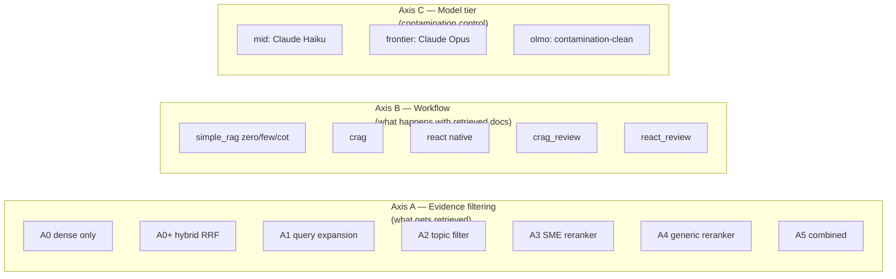
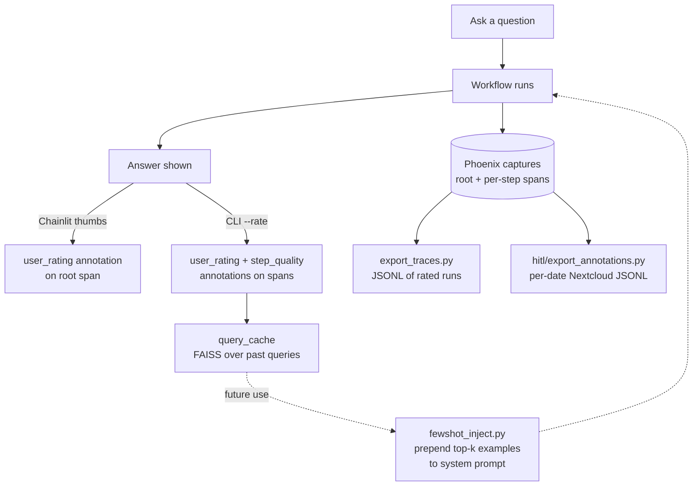

# Onboarding — ema_nlp

A one-stop "where am I, what does this do, how do I run things" guide. Read this when returning to the project after time away. It complements `docs/ARCHITECTURE.md` (which goes deeper on data flow) and `docs/RETRIEVAL_PIPELINE.md` (which goes deeper on LlamaIndex internals).

---

## What this project is

A RAG benchmark over EMA (European Medicines Agency) regulatory Q&A documents. Three goals: (1) learn RAG end-to-end, (2) produce a publishable benchmark with lift metrics, (3) build a portfolio piece showing pharma + ML.

The experimental design is a 3D grid: **retrieval strategy × workflow × model tier**. Each cell is one YAML config in `harness/configs/`, run via `python -m harness.run_eval --config <file>`.

---

## The three orthogonal axes



A is configured under the YAML `retrieval:` and `ablation:` blocks. B is configured under `orchestration:`. C is configured via `harness/configs/models.yaml` (role-based bindings).

---

## End-to-end data flow

```mermaid
flowchart TD
    M[(MongoDB<br/>ema_scraper)] -->|corpus/build_corpus.py| C[corpus/corpus.jsonl<br/>26k Q&As, in Git]
    C -->|python -m harness.embed| IDX[harness/index/<br/>FAISS + docstore<br/>local only]

    Q[Query] --> RC{RetrievalConfig}
    IDX --> RC

    RC --> RET[retrieve_with_config<br/>flat | recursive | hierarchical]
    RET --> ABL{Ablation A wrappers}
    ABL --> DOCS[ranked docs]

    DOCS --> WF{get_workflow name}
    WF --> ANS[answer + cited_qa_ids]

    ANS --> J[harness.judge<br/>faithfulness + correctness]
    ANS --> PHX[(Phoenix traces<br/>localhost:6006)]

    J --> R[results/run_id/<br/>retrieval.json<br/>judge_scores.jsonl<br/>run_summary.md]
    PHX --> HITL[HITL annotation<br/>rating CLI / Chainlit thumbs]
```

`corpus.jsonl` is in Git. The FAISS index is **not** — it's rebuilt locally (~25 min for BGE-large-en on 26k records, ~2 s to reload after first build).

---

## File map — where to look for what

| You want to... | Read / edit |
|---|---|
| Understand corpus schema | `corpus/models.py` (`QARecord`) |
| Change how docs are retrieved | `harness/retrieve.py` (`RetrievalConfig`, `retrieve_with_config`) |
| Add a new ablation step | `harness/ablations/*` + plug into `run_eval.py` retrieval pipeline |
| Add a new workflow strategy | `harness/workflows/<name>.py` + register in `harness/workflows/registry.py` |
| Change which model does what role | `harness/configs/models.yaml` |
| Run interactive labeling session | `harness/label_session.py` |
| Run an experiment | `harness/configs/<config>.yaml` → `python -m harness.run_eval --config ...` |
| Compare results across runs | `scripts/generate_comparison_report.py` → writes `workflow_comparison.md` |
| Chat interactively | `bash run_ui.sh` → Chainlit on :8000, Phoenix on :6006 |
| Sanity-check the agent on 5 questions | `python -m ablations.B_process_rewards.run_b1_sanity` |
| Rate a run in CLI mode | Add `--rate` to the sanity-check command above |
| Run a full interactive labeling session | `python -m harness.label_session --workflow react --config harness/configs/workflow_react.yaml --n 20 --sample stratified` |
| Export rated traces to JSONL | `python -m harness.export_traces --min-rating 4 --output ...` |
| Tag corpus with IDMP concepts | `python scripts/tag_concepts.py` (requires RDF in Nextcloud) |

---

## The benchmark — what's being measured

`benchmark/benchmark.jsonl` (45 questions, in Git) is stratified into four difficulty tiers:

- **T1 Lookup** — single Q&A answers it directly
- **T2 Scoping** — relevant doc is adjacent to distractors with similar vocabulary
- **T3 Multi-hop** — answer requires two cross-referenced Q&As
- **T4 Synthesis** — answer requires combining across multiple procedures (e.g. "compare Article 30 vs Article 31")

T4 is the systematic failure case across all configurations today (correctness ≤2/5). That's expected — flat k=10 retrieval can't reliably surface evidence from both procedures simultaneously.

The headline metric is **lift**: open-book correctness minus closed-book correctness. Closed-book = same questions answered with no retrieval context. A model that memorized the corpus gets zero lift. Run via `python -m harness.compute_lift --closed <dir> --open <dir>`.

---

## Three example configs — read these to understand the YAML

| File | What it demonstrates |
|---|---|
| `harness/configs/baseline_a0plus.yaml` | Minimal hybrid retrieval, no ablations, no orchestration. Good baseline reference. |
| `harness/configs/ablation_a_a3.yaml` | Retrieval baseline + SME reranker. Shows the `ablation:` block. |
| `harness/configs/workflow_crag.yaml` | A0+ retrieval + CRAG workflow. Shows the `orchestration:` block. |

`harness/configs/models.yaml` is separate — it defines the model catalog and role bindings. Change `roles.judge: claude_opus → claude_haiku` to swap the judge model across **all** runs without touching individual configs.

---

## Workflow registry — the 9 strategies

From `harness/workflows/registry.py`:

| Name | What it does |
|---|---|
| `simple_rag_zero` | retrieve → generate (zero-shot) |
| `simple_rag_few` | retrieve → generate (SME few-shot examples) |
| `simple_rag_cot` | retrieve → generate (chain-of-thought) |
| `react` | `ReActNativeWorkflow` — hand-written think/act/observe loop; per-step Phoenix spans; agent role = Opus |
| `crag` | retrieve → grade ⇄ rewrite → generate |
| `summarize_rag` | retrieve → summarize → generate |
| `crag_summarize` | CRAG loop → summarize → generate |
| `crag_review` | CRAG loop → generate → faithfulness review |
| `react_review` | ReAct → single faithfulness review pass |

Every entry returns an object with `invoke(inputs)` and `ainvoke(inputs)`. Inputs is always `{"question": str, "few_shot_context"?: str}`.

---

## HITL — the human-in-the-loop loop



**Current state:**
- The Chainlit UI captures thumbs only (no per-step labels).
- `b1_trajectories.jsonl` has 5 populated trajectories (3–5 steps each, `ema_search` tool calls confirmed).
- `harness/label_session.py` runs interactive labeling over N stratified/uniform questions on any registered workflow — use this to build up the rated-examples pool.
- `harness/fewshot_inject.py:get_fewshot_context()` is wired into both `app.py` (automatic injection when ≥ 3 rated entries exist) and `run_eval.py` (opt-in via `cache_inject: true` in the YAML config).
- Loop closes when ≥ 3 examples with rating ≥ 4 exist in the query cache.

---

## Common tasks

### Run a single config

```bash
source ~/.myenvs/ema_nlp.env  # if not auto-loaded
python -m harness.run_eval --config harness/configs/baseline_a0plus.yaml
```

Outputs land in `~/Nextcloud/Datasets/ema_nlp/results/baseline_a0plus/`.

### Compare across runs

```bash
python scripts/generate_comparison_report.py
```

Reads every subdirectory of `~/Nextcloud/Datasets/ema_nlp/results/` and writes `workflow_comparison.md` with retrieval tables, judge tables, and a narrative findings section.

### Chat with the system

```bash
bash run_ui.sh                       # Phoenix + Chainlit
# or
PHOENIX_DISABLED=1 bash run_ui.sh    # Chainlit only
```

Chainlit on http://localhost:8000, Phoenix on http://localhost:6006. The Chainlit session uses **one fixed workflow** per session — controlled by env vars and defaults in `app.py`. To swap workflows you currently have to restart.

### Compute lift

```bash
# 1. Run closed-book config (no retrieval context)
python -m harness.run_eval --config harness/configs/<closed_config>.yaml

# 2. Run open-book equivalent
python -m harness.run_eval --config harness/configs/<open_config>.yaml

# 3. Compute lift
python -m harness.compute_lift \
  --closed ~/Nextcloud/Datasets/ema_nlp/results/<closed> \
  --open   ~/Nextcloud/Datasets/ema_nlp/results/<open>
```

### Rebuild the index after corpus changes

```bash
rm harness/index/docstore.json    # force-rebuild trigger
python -m harness.embed
```

### MongoDB sync

```bash
bash scripts/sync_mongo.sh export   # on source machine
bash scripts/sync_mongo.sh import   # on destination after Nextcloud syncs
# or direct over Tailscale:
bash scripts/sync_mongo.sh pull --host <tailscale-host>
```

---

## What you should hold in your head

1. **Three axes, one entry point.** Every experiment is a YAML; `run_eval.py` is the single executor.
2. **Retrieval is unified.** `RetrievalConfig` + `retrieve_with_config()` is the one path. Strategy (flat/recursive/hierarchical) and mode (dense/bm25/hybrid) are orthogonal. Ablations wrap on top in `run_eval.py`.
3. **Workflows are a registry.** `get_workflow(name, ...)` returns something with `invoke()`. Always. No exceptions.
4. **Models are role-bound.** Code never hardcodes a model. It asks `get_llm("agent")`, `get_llm("judge")`, etc. `models.yaml` decides what those mean.
5. **Phoenix is the trace store and labeling surface.** Every LlamaIndex call instruments automatically. Annotations are the human signal.
6. **Corpus is in Git, index and results are not.** Index rebuilds from corpus; results live in Nextcloud at `~/Nextcloud/Datasets/ema_nlp/results/`.

---

## Where things hurt right now

- No interactive workflow-switching UI — Chainlit runs one fixed workflow per session; switching requires a restart. A Streamlit orchestration dashboard is the planned next step (see `CLAUDE_GUIDANCE.md` P2).
- Few-shot injection requires ≥ 3 rated examples to fire; the pool is currently small. Run `harness/label_session.py` sessions to build it up.
- Ablation B (process-reward supervision) full run still pending — infrastructure done, needs labeling data.
