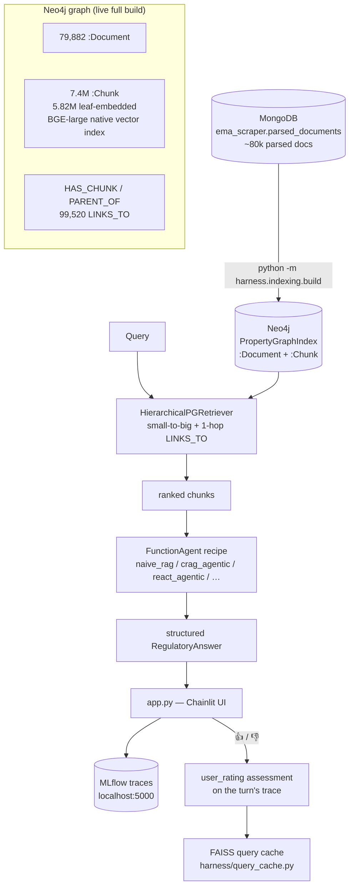
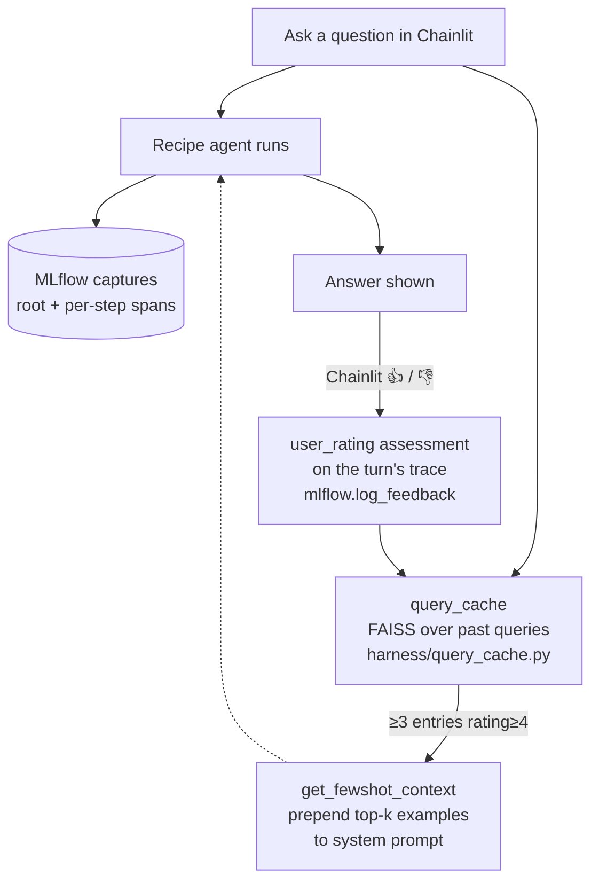

# Onboarding — ema_nlp

> ✅ **Post-refactor (2026-06-04, updated 2026-07-05).** Retrieval is LlamaIndex-first over a
> **Neo4j hierarchical `PropertyGraphIndex`** (see [`docs/RETRIEVAL.md`](RETRIEVAL.md)). The old
> Postgres + pgvector + FAISS-over-`corpus.jsonl` stack, the `EMA_RETRIEVER` switch, and
> `harness/retrieve*.py` / `harness/embed*.py` were **deleted** (LIR-012). The pre-refactor
> eval suite was archived off-branch (`archive/pre-llamaindex-refactor`); a **new recipe-based
> eval runner + LLM judges are rebuilt on this branch** (`harness/eval/`, `scripts/run_eval.py`).
> Still archived-only: the ablation grid, closed-book baselines, and the lift computation.

A one-stop "where am I, what does this do, how do I run things" guide. Read this when returning to the project after time away. It complements [`docs/ARCHITECTURE.md`](ARCHITECTURE.md) (data flow + stores), [`docs/RETRIEVAL.md`](RETRIEVAL.md) (the Neo4j retrieval pipeline), and [`docs/RECIPES.md`](RECIPES.md) (the recipe config surface).

---

## What this project is

A RAG benchmark over EMA (European Medicines Agency) regulatory documents. Three goals: (1) learn RAG end-to-end, (2) produce a publishable benchmark with lift metrics, (3) build a portfolio piece showing pharma + ML.

Two separable layers:

- **Retrieval** runs over the **narrative corpus** — the full PDF + HTML body text from `ema_scraper.parsed_documents` (~80k docs, EPARs included since 2026-06-02), indexed into a Neo4j `PropertyGraphIndex`. This is what the chat UI and the recipe-configured agent query.
- **Benchmark** is `benchmark/benchmark.jsonl` (45 curated questions) scored with the lift metric. `corpus/corpus.jsonl` (26,251 mined Q&A pairs) is benchmark/material only — it is **not** the runtime retrieval target.

---

## End-to-end data flow



`corpus.jsonl` and `benchmark.jsonl` are in Git. The Neo4j graph is **not** — it is rebuilt from Mongo by `python -m harness.indexing.build` (full GPU build over 79,882 docs; embeddings are BAAI/bge-large-en-v1.5 on local CUDA, leaf chunks only). Link extraction (`harness/indexing/links.py`) is scoped to `<main class="main-content-wrapper">` and produces typed `LINKS_TO` edges carrying `{kind, link_context, document_type, anchor}`.

---

## File map — where to look for what

| You want to... | Read / edit |
|---|---|
| Understand corpus schema | `corpus/models.py` (`QARecord`) |
| Change how docs are retrieved | `harness/indexing/property_graph.py` (`HierarchicalPGRetriever`, `open_index`) |
| Pick which retrieval setup is active | `EMA_INDEX_PROFILE` env var → `harness/configs/index/<name>.yaml` (default `neo4j_hier`) |
| Build / rebuild the Neo4j index | `python -m harness.indexing.build` (entry: `harness/indexing/build.py`) |
| Add a new index kind or retriever strategy | register via `harness/indexing/registry.py` + a new profile YAML |
| Add a new pipeline (technique/mode) | drop a recipe YAML in `harness/configs/recipes/` (or `$EMA_CONFIG_DIR/recipes/`) — see [`RECIPES.md`](RECIPES.md) |
| Add a new tool (RAG technique) | implement + `@register_tool` in `harness/tools/`, then list it in a recipe's `tools` — see [`RAG_TECHNIQUES.md`](RAG_TECHNIQUES.md) |
| Change an agent's instructions | edit its prompt under `harness/prompts/` (e.g. `agent_crag.md`) named by the recipe's `system_prompt` |
| Change which model does what role | `harness/configs/models.yaml` (role-based bindings via `harness/llms.py`) |
| Chat interactively | `bash run_ui.sh` → Chainlit on :8000, MLflow on :5000 |
| Inspect / collect feedback | MLflow trace assessments (👍/👎 via `mlflow.log_feedback`) + Chainlit; export with `harness/export_traces.py`; cache in `harness/query_cache.py` |
| Tag docs with IDMP concepts | `python scripts/tag_concepts.py` (requires RDF in Nextcloud) |

> **Rebuilt on this branch (2026-07-04):** the eval runner + LLM judges — `scripts/run_eval.py`
> runs a recipe over the benchmark (one MLflow run per question type, `mlflow.genai`
> faithfulness/correctness judges). **Still archived** (on `archive/pre-llamaindex-refactor`):
> the old `harness/embed.py`, `harness/retrieve.py`, `harness/label_session.py`,
> `harness/compute_lift.py`, the ablation grid, and the FAISS-over-`corpus.jsonl` doc index.
> FAISS survives **only** as the semantic query cache (`harness/query_cache.py`).

---

## The benchmark — what's being measured

`benchmark/benchmark.jsonl` (45 questions, in Git: 20 T1 / 10 T2 / 10 T3 / 5 T4) is stratified into four difficulty tiers:

- **T1 Lookup** — single document answers it directly
- **T2 Scoping** — relevant doc is adjacent to distractors with similar vocabulary
- **T3 Multi-hop** — answer requires two cross-referenced documents
- **T4 Synthesis** — answer requires combining across multiple procedures (e.g. "compare Article 30 vs Article 31")

The headline metric is **lift**: open-book correctness minus closed-book correctness. Closed-book = same questions answered with no retrieval context. A model that memorized the corpus gets zero lift.

> **Status (2026-07-04):** a recipe-based benchmark runner is **rebuilt on this branch** —
> `scripts/run_eval.py --recipe <name>` scores the benchmark with `mlflow.genai` judges, one
> MLflow run per question type. Not yet rebuilt: closed-book baselines and the **lift**
> computation (so the headline metric can't be produced yet). The benchmark items themselves
> are current and in Git. See [`project_roadmap/ABLATIONS.md`](../project_roadmap/ABLATIONS.md).

---

## Retrieval profiles — the YAML that selects retrieval

The active retrieval setup is chosen by the `EMA_INDEX_PROFILE` env var (default `neo4j_hier`), which names a file under `harness/configs/index/`. A profile describes how the index is built (`index.kind`, chunking, scope) and which retriever to attach (`retrieval.strategy`, `k`). Swapping retrieval setups is an env change, not a code edit.

Currently **one** retrieval strategy is built: `hierarchical` over `index.kind = property_graph` (profile `neo4j_hier`). The `vector_flat` / `hierarchical_links` / `property_graph_native` tracks are spec-only — see [`docs/RETRIEVAL_TRACKS.md`](RETRIEVAL_TRACKS.md).

`harness/configs/models.yaml` is separate — it defines the model catalog and role bindings (`roles.agent` / `roles.grader` / `roles.judge` / …). Change a role binding to swap models everywhere without touching individual configs; recipes can also name a model directly (`generation.model`).

---

## Recipe registry — the built-in recipes

From `harness/configs/recipes/*.yaml` (+ `$EMA_CONFIG_DIR/recipes/`). One engine — a
`FunctionAgent` — configured per recipe; the toolset + prompt define the technique. See
[`docs/RECIPES.md`](RECIPES.md) + [`docs/RAG_TECHNIQUES.md`](RAG_TECHNIQUES.md).

| Recipe | Tools | What it does |
|---|---|---|
| `naive_rag` (default) | `ema_search` | retrieve once → answer (lightest baseline) |
| `crag_agentic` | `corrective_search`, `ema_search` | CRAG: grade ⇄ rewrite-retry (bounded) for multi-hop/scoping |
| `react_agentic` | `ema_search`, `resolve_substance` | reason→act loop |
| `regulatory_agent` | `ema_search`, `resolve_substance` | the full agent |
| `agentic_reranked` | + `native` pipeline | query-expansion + cross-encoder rerank (GPU) |
| `agentic_judged` | + inline judge | faithfulness judge per turn (logged to MLflow) |
| `regulatory_fewshot` | + few-shot | injects 👍-rated past answers as examples |

A single Chainlit **recipe dropdown** selects one (the resolved recipe is stamped on every
MLflow trace); `model`/`temperature`/`retrieval_k`/`cache` are live overrides. The pipeline
exposes `invoke(inputs)` / `ainvoke(inputs)` with inputs `{"question": str, "few_shot_context"?: str}`
and returns a structured `RegulatoryAnswer`. Programmatically: `build_recipe(get_recipe(name), index)`.

---

## HITL — the human-in-the-loop loop



**Current state:**
- The Chainlit UI captures a 👍/👎 rating per answer, written as a `user_rating` trace assessment (feedback) on the turn's MLflow trace (`mlflow.log_feedback`).
- MLflow is the trace store and HITL/feedback surface; `app.py` enables `mlflow.llama_index.autolog()` + a per-turn `harness.obs.tracing.traced` span against the `MLFLOW_TRACKING_URI` env var (default `http://localhost:5000`). Rated traces are harvested to JSONL with `harness/export_traces.py`.
- `harness/query_cache.py` is a FAISS index over past query embeddings; `get_fewshot_context()` (in `harness/fewshot_inject.py`) is wired into `app.py` and injects top-k rated examples once ≥ 3 entries with rating ≥ 4 exist.

---

## Common tasks

### Start the data services

```bash
scripts/start_services.sh   # MongoDB (mongo:8.0.4) + Neo4j (neo4j:5.26 community), Docker, health-checked
```

No Postgres — it was removed by the refactor.

### Chat with the system

```bash
bash run_ui.sh                            # MLflow (:5000) + Chainlit (:8000)
# or
EMA_TRACING_DISABLED=1 bash run_ui.sh     # Chainlit only, no tracing
```

Chainlit on http://localhost:8000, MLflow on http://localhost:5000. The **recipe** is selected at session start via the chat-profile dropdown (one profile per recipe, 7 built-ins) or live via the settings panel's Recipe selector; changing it does not require a restart.

### Build / rebuild the Neo4j index

```bash
# whole corpus, GPU, fresh build (~80k docs; long-running)
python -m harness.indexing.build --full --reset --embed-device cuda

# resume an interrupted full build (no --reset — already-built docs are skipped)
python -m harness.indexing.build --full --embed-device cuda

# a 500-doc slice for quick iteration
python -m harness.indexing.build --limit 500

# rebuild only the LINKS_TO edges over an existing graph
python -m harness.indexing.build --full --reset-links
```

The active profile (`EMA_INDEX_PROFILE`, default `neo4j_hier`) decides chunking/scope/retriever. Use `--pause-every-docs` / `--pause-seconds` to throttle the GPU on long builds (the 3090 can wedge its GSP firmware under sustained load — see machine memory).

### Tag docs with IDMP concepts

```bash
python scripts/tag_concepts.py        # requires IDMP RDF in Nextcloud
```

> **Eval:** `python scripts/run_eval.py --recipe <name>` (recipe × benchmark → per-type MLflow
> runs). **Still archived (off-branch):** the cross-run comparison report, interactive labeling
> (`harness.label_session`), computing lift (`harness.compute_lift`), and `harness.embed` —
> they live on `archive/pre-llamaindex-refactor`.

---

## What you should hold in your head

1. **One retrieval store.** Neo4j `PropertyGraphIndex` (`:Document` + `:Chunk`, `HAS_CHUNK`/`PARENT_OF`/`LINKS_TO` edges, native chunk vector index). `HierarchicalPGRetriever` walks small-to-big and expands 1 hop over `LINKS_TO`. There is no pgvector, no FAISS doc index, no `EMA_RETRIEVER` switch.
2. **Retrieval is a profile, not code.** `EMA_INDEX_PROFILE` → `harness/configs/index/<name>.yaml` selects the index kind + retriever. Today only `neo4j_hier` (hierarchical over property_graph) is built.
3. **One engine, configured by recipes.** Every pipeline is a `FunctionAgent` configured by a recipe YAML; RAG techniques are tools + prompt instructions (naive RAG = `ema_search`; CRAG = `corrective_search`; ReAct = the tool loop). `build_recipe(get_recipe(name), index)` returns the runner (`invoke()`/`ainvoke()`). The legacy `harness/workflows/*` Workflow engine was retired 2026-06-25.
4. **Models are role-bound.** Code never hardcodes a model — it asks `get_llm("agent")` / `get_llm("grader")` / `get_llm("judge")` etc. `models.yaml` decides what those mean; recipes can override with a direct model name.
5. **MLflow is the trace store and HITL/feedback surface.** Every LlamaIndex call is instrumented automatically (`mlflow.llama_index.autolog()`, `MLFLOW_TRACKING_URI`); 👍/👎 trace assessments are the human signal.
6. **Corpus + benchmark are in Git; the graph is not.** The Neo4j graph rebuilds from Mongo `parsed_documents`. Eval results live in MLflow (the system of record); the lift/ablation machinery is still archived off-branch.

---

## Where things hurt right now

- The benchmark runner + LLM judges are rebuilt (`scripts/run_eval.py`), but **closed-book baselines and the lift metric are not** — the headline Phase 3/4 numbers can't be produced yet; the ablation grid is still archived (`archive/pre-llamaindex-refactor`). The runner itself is also not yet runtime-verified on the GPU host.
- Only one retrieval strategy is built (`neo4j_hier`); `vector_flat` / `hierarchical_links` / `property_graph_native` are spec-only (`docs/RETRIEVAL_TRACKS.md`).
- Few-shot injection fires once ≥ `min_examples` well-rated similar interactions exist (default 1, per-recipe via `FewshotPolicy`); the rated pool is still small.
- The 3090 can wedge its GSP firmware under sustained CUDA load — throttle long index builds with the power cap + `--pause-every-docs` (see machine memory) before any reboot.
