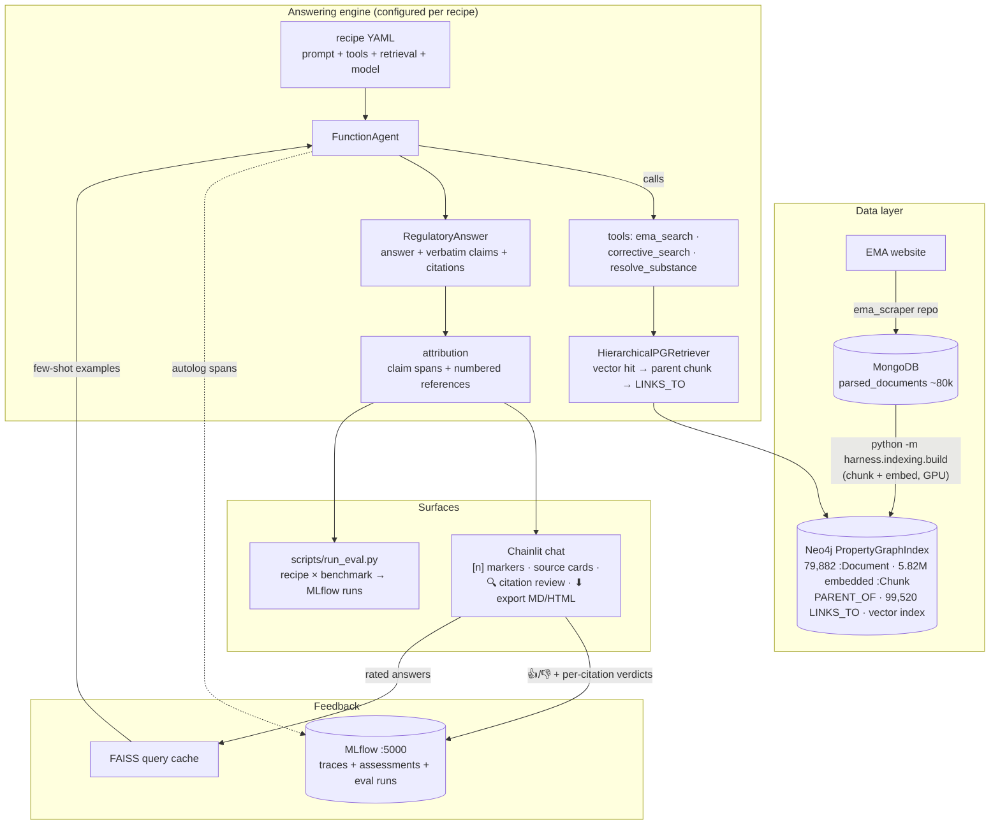
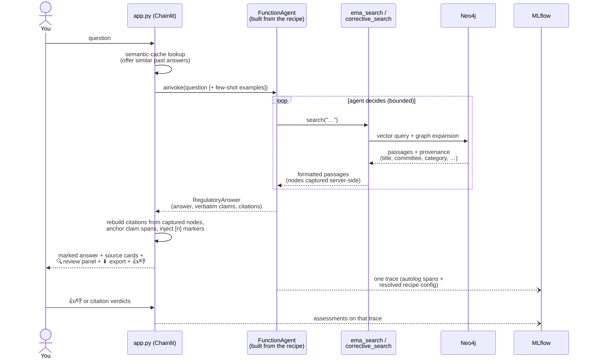

# Onboarding — ema_nlp

**Read this first, top to bottom, when returning to the project.** It rebuilds the mental
model from the big picture down to the file level, then points at the deeper docs. Nothing
here requires remembering earlier states of the repo — several older architectures
(Postgres+pgvector, FAISS document index, the 7-workflow engine, Arize Phoenix) were fully
deleted; what follows describes only what exists now.

Reading order after this file:
[`RECIPES.md`](RECIPES.md) (how to configure pipelines, with worked examples) →
[`RETRIEVAL.md`](RETRIEVAL.md) (the Neo4j index internals) →
[`CITATIONS.md`](CITATIONS.md) (citations, SME review, export) →
[`ARCHITECTURE.md`](ARCHITECTURE.md) (module map + stores) →
[`RUNTIME_VERIFICATION.md`](RUNTIME_VERIFICATION.md) (the GPU-host walk that is the next step).

---

## 1. What this project is (in three sentences)

A **question-answering benchmark plus reference RAG system** built from the European
Medicines Agency's public regulatory content (guidelines, Q&A documents, assessment
reports). The end goal is to measure *where subject-matter-expert effort pays off* in
agentic RAG — better source curation? retrieval filtering? prompting? — using a curated
45-question benchmark and a **lift** metric (answer quality with retrieval minus without).
Along the way it is a working, inspectable chat system over ~80,000 EMA documents.

One domain trap to internalize immediately: in EMA documents, **"AI" means Acceptable
Intake** (a toxicology limit in ng/day) — never artificial intelligence.

---

## 2. The 60-second mental model

Six sentences that carry most of the architecture. Everything else is detail.

1. **All documents live in a Neo4j graph.** ~80k EMA pages/PDFs are chunked and embedded
   into a `PropertyGraphIndex`: `:Document` and `:Chunk` nodes, with edges for section
   hierarchy (`PARENT_OF`) and page→PDF hyperlinks (`LINKS_TO`). The website's *structure*
   is a retrieval signal, not just its text.
2. **There is exactly one answering engine**: a LlamaIndex `FunctionAgent` — an LLM that
   can call tools in a loop and must return a typed, structured answer.
3. **A "recipe" is a YAML file that configures that engine** — which system prompt, which
   tools, which retrieval setup, which model, and optional few-shot/judge stages. Different
   RAG techniques (naive RAG, CRAG, ReAct) are *not* different codebases; they are
   different recipes. Adding a pipeline = adding a YAML file.
4. **Answers are structured and cited.** The agent returns a `RegulatoryAnswer` (answer
   text + verbatim claims + citations + confidence + caveats); the system rebuilds citation
   provenance from what was *actually retrieved*, anchors each claim to its exact span in
   the answer, and renders clickable `[n]` citation markers.
5. **MLflow is the single system of record** for traces, human feedback (👍/👎 and
   per-citation verdicts), judge scores, and eval results. Every turn is one trace, stamped
   with the *resolved* recipe config — the trace never claims a setting that didn't run.
6. **Configs are files, results are traceable.** Recipes, prompts, index profiles, model
   bindings, and export options are all YAML/Markdown in `harness/configs/` (overridable
   via `$EMA_CONFIG_DIR`); every result links back to the exact config that produced it.

---

## 3. The big picture



Three things intentionally *not* in the picture because they don't exist: no second
retrieval store (pgvector/FAISS document indexes were deleted), no per-technique workflow
engines (deleted 2026-06-25), no second observability system (Phoenix removed 2026-06-22).

---

## 4. Life of a question

The single most useful thing to understand. When you type a question into the chat:



Step by step, with the code that does it:

1. **Cache check** (`harness/query_cache.py`): the question is embedded; if a similar past
   question with a stored answer exists, you're offered it before any LLM runs.
2. **Recipe → agent** (`harness/recipes/build.py:build_recipe`): the selected recipe was
   assembled at session start into a `FunctionAgent` wrapped in an `AgentWorkflowAdapter`
   (the uniform `invoke`/`ainvoke` entry point everything uses — UI, demo script, eval).
3. **The agent loops over tools** (`harness/agents/`): the prompt prescribes *how* (e.g.
   the naive recipe says "search exactly once"); the tools do the deterministic work. The
   passages every tool retrieves are also **captured server-side** in a sink
   (`harness/tools/search.py:capture_search_nodes`) — the LLM only ever sees text, so real
   provenance (chunk ids, scores, titles) must come from the system, not the model.
4. **Structured answer** (`harness/schemas/answer.py`): the agent must return a
   `RegulatoryAnswer`. Its `claims` are contractually **verbatim spans** of the answer
   text, each with the sources supporting exactly that span.
5. **Attribution** (`harness/attribution.py`): the server locates each claim in the answer
   (exact match, fuzzy fallback), numbers the references by first appearance, injects
   `[n]` markers, and pairs every citation with its **full** retrieved passage. If the
   model produced no usable claims, everything degrades to a plain answer with
   score-ordered sources — never an error.
6. **Rendering** (`app.py`): the `[n]` markers are clickable (they open the source card);
   below the answer sit the **🔍 Review citations** panel (side-by-side answer/source view
   with per-citation verdict buttons) and the **⬇ Export** button (Markdown + HTML
   downloads). See [`CITATIONS.md`](CITATIONS.md).
7. **Observability** (`harness/obs/`): the whole turn is one MLflow trace — every LLM and
   retrieval call as a span, the resolved recipe as `ema.*` attributes, `ema.recipe` as a
   searchable tag. Your 👍/👎 and per-citation verdicts attach to that same trace as
   assessments.

---

## 5. The three config surfaces

Everything tunable lives in one of three YAML surfaces (all overridable by dropping a
same-named file under `$EMA_CONFIG_DIR/<namespace>/` — external files shadow built-ins):

| Surface | File(s) | Decides | Selected by |
|---|---|---|---|
| **Recipe** | `harness/configs/recipes/*.yaml` | prompt, tools, output schema, retrieval profile + pipeline, few-shot, model, judge | UI dropdown / `EMA_RECIPE` / `--recipe` |
| **Index profile** | `harness/configs/index/*.yaml` | how the Neo4j index is built (chunk sizes, scope) and queried (retriever, k) | the recipe's `index_profile` (default `neo4j_hier`) |
| **Models** | `harness/configs/models.yaml` | the model catalog + role bindings (`agent`, `grader`, `judge`, `reviewer`, …) | roles referenced by code/recipes |

Two more, smaller: `harness/configs/retrieval/*.yaml` (optional query-expansion + rerank
pipeline a recipe can attach) and `harness/configs/export/default.yaml` (what exports
contain). Prompts are Markdown files in `harness/prompts/`.

A recipe in seven lines (the complete built-in baseline, `naive_rag.yaml` abridged):

```yaml
recipe:
  label: "Naive RAG"
  default: true
  orchestration:
    system_prompt: agent_naive.md   # "search once, answer only from the passages"
    tools: [ema_search]             # one tool = classic retrieve-then-generate
    output_schema: RegulatoryAnswer
```

Everything not stated uses defaults (index profile `neo4j_hier`, model `claude_opus`, no
rerank/few-shot/judge). **Worked examples — including reproducing the CRAG paper — are in
[`RECIPES.md`](RECIPES.md) §"Worked examples".**

### The built-in recipes

| Recipe | Technique | Extra stages |
|---|---|---|
| `naive_rag` (default) | retrieve once → answer | — |
| `crag_agentic` | **CRAG** (Yan et al. 2024): grade retrieval, rewrite + retry when insufficient | — |
| `react_agentic` | ReAct-style tool loop | — |
| `regulatory_agent` | full agent (search + substance lookup) | — |
| `agentic_reranked` | full agent | query expansion + cross-encoder rerank (GPU) |
| `agentic_judged` | full agent | inline faithfulness judge + soft reviewer gate (threshold 3) |
| `regulatory_fewshot` | full agent | injects 👍-rated past answers as few-shot examples |

---

## 6. The feedback loops

Three signals accumulate, all in MLflow (plus the local query cache):

1. **Answer-level 👍/👎** → a `user_rating` assessment on the turn's trace **and** a 1–5
   rating in the FAISS query cache. Recipes with `fewshot.enabled` inject well-rated
   similar past answers as examples on future questions — learning without training.
2. **Per-citation verdicts** (the SME loop, new): in the 🔍 review panel each reference
   takes *supports / partial / no*, an optional "wrong source type — prefer `<category>`"
   flag (e.g. an EPAR was retrieved where a guideline belongs), and a note. Each verdict is
   one `citation_<rank>_<chunk>` assessment carrying rank/ids/category — exactly the data a
   future learned re-ranker needs. Today, the deterministic `doc_type_priority` reranker is
   the actionable knob (see [`CITATIONS.md`](CITATIONS.md) §4).
3. **LLM judge scores** (optional per recipe): a gold-free faithfulness judge grades each
   answer against its retrieved context; with `judge.threshold` set, a weak answer ships
   with a visible ⚠️ caution note (advisory — never blocked).

---

## 7. Where things live (file map)

| You want to… | Go to |
|---|---|
| Add/modify a pipeline | `harness/configs/recipes/` (+ [`RECIPES.md`](RECIPES.md)) |
| Change an agent's instructions | `harness/prompts/agent_*.md` |
| Add a new tool (RAG technique) | `harness/tools/` + `@register_tool` ([`RAG_TECHNIQUES.md`](RAG_TECHNIQUES.md)) |
| Change retrieval behavior | `harness/indexing/property_graph.py` (`HierarchicalPGRetriever`) + `harness/configs/index/` |
| Change rerank / source-type priority | `harness/retrieval/postprocessors.py` + a pipeline YAML's `rerank:` |
| The structured answer / citations schema | `harness/schemas/answer.py` |
| Claim-span attribution / `[n]` markers | `harness/attribution.py` |
| Source-category rules (guideline vs EPAR…) | `harness/retrieval/doc_categories.py` |
| Export formats + options | `harness/export/` + `harness/configs/export/default.yaml` |
| The SME review panel | `public/elements/CitationReview.jsx` + `app.py` (`cite_feedback`) |
| Tracing / feedback helpers | `harness/obs/` (`setup_tracing`, `log_user_feedback`, `log_citation_feedback`) |
| Eval runner | `harness/eval/runner.py` + `scripts/run_eval.py` |
| Model catalog / roles | `harness/configs/models.yaml` + `harness/llms.py` |
| The chat app itself | `app.py` (Chainlit handlers, ~1000 lines, heavily commented) |
| Benchmark items | `benchmark/benchmark.jsonl` (45 questions, T1–T4) |
| Corpus extraction (phase 1, done) | `corpus/` |

---

## 8. Running things

```bash
# 0) once: services (Docker) — MongoDB + Neo4j, health-checked
scripts/start_services.sh

# 1) chat (MLflow server on :5000 + Chainlit on :8000)
bash run_ui.sh

# 2) one-off question from the CLI (same recipe engine as the UI)
python scripts/run_agent_demo.py --recipe crag_agentic "What is the AI for NDMA?"

# 3) evaluate a recipe on the benchmark (one MLflow run per question type)
python scripts/run_eval.py --recipe naive_rag            # all 45 questions
python scripts/run_eval.py --recipe crag_agentic --types T3 --limit 2   # smoke run

# 4) rebuild the Neo4j index from Mongo (GPU, long-running; see RETRIEVAL.md)
python -m harness.indexing.build --full --embed-device cuda

# tests (offline, no services needed; ~490 tests)
pytest -q --ignore=tests/test_mongo_source.py
```

Useful env vars: `EMA_RECIPE` (default recipe), `EMA_INDEX_PROFILE` (index profile),
`EMA_CONFIG_DIR` (external configs), `EMA_MLFLOW_EXPERIMENT` (experiment name),
`EMA_TRACING_DISABLED=1` (no MLflow).

---

## 9. The benchmark and what's still missing for it

`benchmark/benchmark.jsonl`: 45 curated questions — 20 **T1 Lookup**, 10 **T2 Scoping**
(distractor-adjacent), 10 **T3 Multi-hop** (cross-referenced documents), 5 **T4 Synthesis**
(combine across procedures) — each with gold answers and sources. Metrics are always
reported **per type**, and the headline number is **lift** (open-book minus closed-book) to
neutralize training-data contamination (see `project_roadmap/LEAKAGE.md`).

Current state: the recipe × benchmark runner **works live** (`scripts/run_eval.py`, judges
included, results to MLflow — verified on the GPU host, `RUNTIME_VERIFICATION.md` §8);
**closed-book baselines and the lift computation do not exist yet** — they are the main
missing piece between "working system" and "benchmark results". The detailed plan for
building them (a `closed_book` recipe + `harness/eval/lift.py` + the `zero_shot_known`
contamination backfill) is [`next/closed_book_lift.md`](next/closed_book_lift.md).

---

## 10. Next step: closed-book baseline + lift

The GPU-host verification walk is **complete** (all steps green incl. the browser
click-through — results + the three defects it caught are in
[`RUNTIME_VERIFICATION.md`](RUNTIME_VERIFICATION.md) §8). The next build is the
**closed-book baseline + lift metric** — detailed plan in
[`next/closed_book_lift.md`](next/closed_book_lift.md); future plans generally live under
[`docs/next/`](next/README.md).

### Possible improvements (designed, not scheduled)

- **Retrieval-miss detection via exact-span search**
  ([`next/retrieval_miss_detection.md`](next/retrieval_miss_detection.md)): an
  OLMoTrace-style infini-gram index over the corpus that buckets answer spans into
  *grounded* / *in-corpus-but-not-retrieved* / *novel* — separates retrieval failures
  from generation failures in eval, gives a mechanical memorization signature next to
  the lift metric, and can later power "suggested source" citation repair in SME
  review. Deliberately gated on a concrete benchmark failure (triggers in the plan's
  §5), per the complexity rule.

Known frictions on the GPU host: the 3090 can wedge its GSP firmware under sustained CUDA
load (throttle long builds; see machine memory), and `git push` may need a credentialed
machine.
