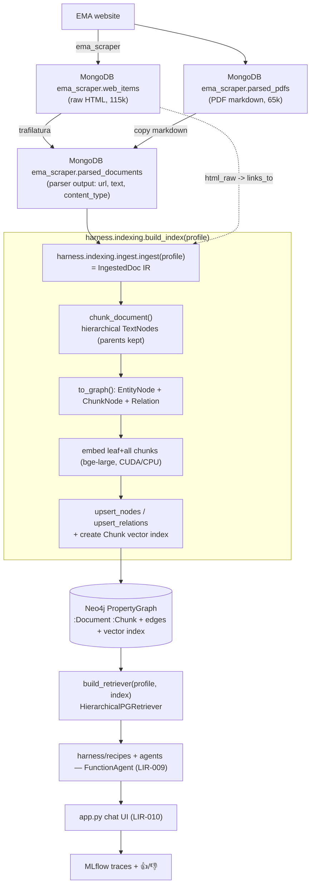
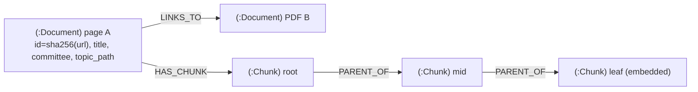
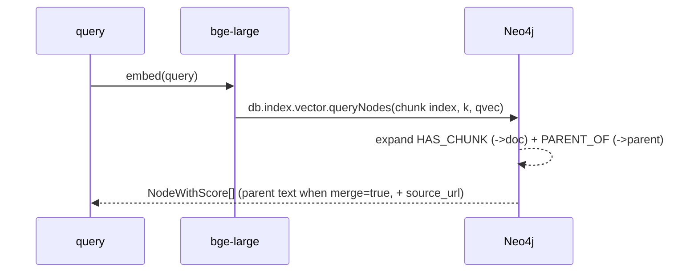

# Retrieval — hierarchical PropertyGraphIndex on Neo4j

Operator's guide to the LlamaIndex-first retrieval stack introduced in the
`refactor/llamaindex-retrieval-pipeline` work (work unit
`2026-05-30_20_llamaindex-retrieval-refactor`). It replaces the former
Postgres + pgvector path (and the even older FAISS-over-`corpus.jsonl` path),
both of which are removed.

> **Refactor status (2026-06-04). Complete.** `harness/indexing/` builds a
> hierarchical `PropertyGraphIndex` in Neo4j and the `HierarchicalPGRetriever`
> returns results over the **full graph** (79,882 `:Document`, 5.82M leaf-embedded
> chunks, 99,520 `LINKS_TO` edges). The recipe engine (`harness/recipes/` → a
> `FunctionAgent`) and the chat UI (`app.py`) consume the LlamaIndex retriever
> (LIR-009/010), and the old pgvector/FAISS stack has been deleted (LIR-012). Track in
> [the work unit](../.claude/work/2026-05-30_20_llamaindex-retrieval-refactor/state.json).

---

## 1. Why Neo4j PropertyGraphIndex

The retrieval thesis is that EMA's **structure is signal**: pages link to PDFs, and
long regulatory documents have a section hierarchy. The store must represent both as
first-class edges, not metadata. A LlamaIndex `PropertyGraphIndex` backed by
`Neo4jPropertyGraphStore` holds the document/chunk graph **and** serves vector
retrieval from Neo4j's native vector index — one store, no separate vector DB.

| Need | How it's met |
|------|--------------|
| Dense chunk retrieval | Neo4j native vector index over `:Chunk(embedding)` |
| Small-to-big (leaf → parent) | `PARENT_OF` edges walked at query time |
| HTML→PDF / cross-page links | `LINKS_TO` edges between `:Document` nodes |
| Doc ↔ chunk provenance | `HAS_CHUNK` edges |
| Add another index kind later | `INDEX_REGISTRY` seam + a profile file |

Dropped, and why: **Postgres/pgvector** (a second store with hand-rolled SQL + a
recursive-CTE traversal that re-implemented what a graph store does natively);
**FAISS-over-`corpus.jsonl`** (indexed the curated Q&A surface, not the narrative
body, and leaked gold answers into eval).

---

## 2. Data + process flow



The **three Mongo collections**:

| Collection | Role | Populated by |
|------------|------|--------------|
| `web_items` | raw scrape (HTML in `html_raw`, `url` is a 1-element list) | `ema_scraper` |
| `parsed_pdfs` | pymupdf4llm PDF markdown (`_id` = url, `markdown`, `error`) | `scripts/ingest_parsed_pdfs.py` |
| `parsed_documents` | canonical parser output (`url, parser, parser_version, content_type, text, text_format, error`) | parsers / `scripts/backfill_parsed_documents_subset.py` |

> **Data note.** `parsed_documents` holds the full ~80k-doc parser output and the Neo4j
> index (79,882 `:Document`) was built from it. The old `link_graph` collection was never
> built — links are extracted at ingest from `web_items.html_raw` by `harness.indexing.links`.
> `scripts/backfill_parsed_documents_subset.py` seeds a small coherent verify subset
> (HTML pages + the PDFs they link to) for quick CPU iteration.

---

## 3. The node / graph model



- **`:Document`** entity node per web page / PDF — `id = sha256(source_url)`, with
  `title`, `committee`, `topic_path`, `reference_number`, `source_type`, and
  `category` (the source category from `harness/retrieval/doc_categories.py`,
  stamped at ingest / backfilled by `scripts/backfill_doc_categories.py` — see §7).
- **`:Chunk`** node per hierarchical chunk — `id`, `text`, `is_leaf`, `doc_id`,
  `source_url`, `embedding`. Multi-level (chunk_sizes `[2048,512,128]`); parent/child
  retained (the old flat chunker discarded non-leaves).
- **Edges:** `HAS_CHUNK` (doc→chunk), `PARENT_OF` (chunk→chunk), `LINKS_TO`
  (doc→doc, only when the target is in the corpus; carries `{kind, link_context,
  document_type, anchor}` properties since the 2026-06-04 link-extraction upgrade —
  99,520 main-content-scoped edges, see `docs/RETRIEVAL_TRACKS.md` §0.8). Edge set is
  extensible (typed concepts later) without reshaping the pipeline.

---

## 4. Configuration — profiles + env var

Which index/retriever is active is chosen by **`EMA_INDEX_PROFILE`** (default
`neo4j_hier`) → `harness/configs/index/<name>.yaml`. Credentials are **not** in the
profile — they come from the environment.

`harness/configs/index/neo4j_hier.yaml`:

```yaml
index:
  kind: property_graph              # only kind in v1 (INDEX_REGISTRY seam allows more)
  source: mongo_parsed_documents
  embed_model: BAAI/bge-large-en-v1.5
  store: { graph: neo4j }           # holds nodes/edges AND the chunk vector index
  chunking: { parser: hierarchical, chunk_sizes: [2048, 512, 128] }
  scope: { committee: [], topic_prefix: "", limit: 50 }   # subset-first
retrieval:
  strategy: hierarchical            # small-to-big merge (+ optional links_to expansion)
  k: 10
  merge: true
  graph: { max_hops: 1, edge_types: [links_to], expand: false }
  # source-category steering keys (oversample, category_quota, graph.expand,
  # graph.expand_categories, graph.max_expand) — see §7; enabled in neo4j_steered.yaml
```

Env (`~/.myenvs/ema_nlp.env`):

```bash
NEO4J_URI=bolt://localhost:7687        # bolt://localhost:7688 if coexisting with a native Neo4j
NEO4J_USER=neo4j
NEO4J_PASSWORD=ema_nlp_dev_pw          # >= 8 chars (Neo4j 5.x)
EMA_INDEX_PROFILE=neo4j_hier           # optional; this is the default
```

---

## 5. Code map (`harness/indexing/`)

| Module | Responsibility |
|--------|----------------|
| `profiles.py` | profile schema + `load_index_profile()` (env/explicit/default) |
| `registry.py` | `INDEX_REGISTRY` / `RETRIEVER_REGISTRY` + `build_index` / `build_retriever` dispatch + `@register_*` decorators |
| `chunking.py` | `chunk_document()` — hierarchical TextNodes, parents kept, deterministic ids |
| `links.py` | `extract_links()` — typed `links_to` edges from a page's `main-content-wrapper` (ported from `ema_scraper` `EmaPageParser`; BCL-component aware). Each carries `kind` (file/page/external) **and** `link_context` (file_component/card_or_listing/inline/other) + `document_type`. See `docs/RETRIEVAL_TRACKS.md` §0.8. |
| `ingest.py` | `ingest(profile)` — Mongo `parsed_documents` → `IngestedDoc` IR (entity + chunks + links) |
| `property_graph.py` | `build_property_graph_index()` + `HierarchicalPGRetriever` (registered `property_graph` / `hierarchical`) |

---

## 6. Build + retrieve

```bash
scripts/start_services.sh        # Mongo + Neo4j (Docker), health-checked
```

```python
from harness.indexing import load_index_profile, build_index, build_retriever

profile  = load_index_profile()                 # EMA_INDEX_PROFILE or neo4j_hier
index    = build_index(profile, reset=True)     # embed chunks -> Neo4j + chunk vector index
retriever = build_retriever(profile, index)     # HierarchicalPGRetriever
nodes = retriever.retrieve("nitrosamine acceptable intake limit")
# -> list[NodeWithScore]; node.metadata has source_url, doc_id, matched_chunk
```

### Retrieval at query time



`HierarchicalPGRetriever` queries the dedicated `:Chunk` vector index (Neo4j's
auto-created `entity` index only covers `:__Entity__`, so chunks need their own),
then in **one Cypher** expands `HAS_CHUNK`→doc and `PARENT_OF`→parent, returning the
**parent** chunk when `merge=true` (small-to-big), deduped, with `source_url`/`doc_id`.

> **Throughput.** CPU embedding is ~0.7 s/chunk (≈17 min for the 40-doc/1462-chunk
> subset). Run the full build on the GPU host (`torch.cuda` available there); CPU is
> fine for small verify slices.

---

## 7. Steering retrieval by source category

**The problem.** The corpus is dominated by product-specific documents (~18k EPAR
assessment reports among 79,882 docs), so a plain vector top-k often comes back
EPAR-saturated even when the question asks about *general* requirements that live
in scientific guidelines or EMA Q&A pages. Reordering after the fact can't fix
that — if no guideline made the top-k, there is nothing to float up. Steering
therefore acts on the **candidate set**, at three independent, composable stages
(2026-07-12; all generic — no category or topic is special-cased in code).

### The category vocabulary

`harness/retrieval/doc_categories.py` classifies every document from its
URL/topic path into `scientific_guideline | qa | epar | medicine_page | other`
(ordered substring rules, offline-testable). The category is **persisted as
`:Document.category`** — stamped at ingest, and backfilled onto an existing
graph with:

```bash
python scripts/backfill_doc_categories.py --dry-run   # histogram only
python scripts/backfill_doc_categories.py             # write d.category (idempotent)
```

Re-run it whenever the classification rules change; chunks/embeddings/edges are
untouched. **The persisted property is what Cypher-side filtering, quotas, and
expansion targeting operate on — run the backfill once before enabling them.**

### Mechanism A — filter + quota (candidate stage)

`HierarchicalPGRetriever` supports:

- **Per-call category filter** — `retriever.with_categories([...])` returns a
  filtered view; the vector query oversamples (`k * oversample`, profile key
  `retrieval.oversample`, default 4) and filters on `:Document.category` in
  Cypher, so the final top-k is drawn from a pool the filter didn't starve.
  This is the seam behind the agent's `source_category` tool argument (below).
- **Category quotas** — profile key `retrieval.category_quota`
  (e.g. `{scientific_guideline: 2, qa: 1}`) guarantees slots in the final k,
  stratifying the oversampled pool (`harness/retrieval/steering.py`,
  `stratify_by_category`). Quotas are *guarantees, not requirements*: a category
  with no pool members yields its slots back; score order is always preserved.

The agent-facing lever: `ema_search(query, source_category="scientific_guideline,qa")`
hard-filters the search; every result line is tagged `category=<...>` so the
agent can *see* a mismatched source mix and steer its follow-up search. An
invalid category returns the valid vocabulary (the agent self-corrects); a
filter that yields nothing automatically retries unfiltered, with an honest
note in the tool output.

### Mechanism B — link-graph expansion (expansion stage)

The graph's 99,520 typed `LINKS_TO` edges encode "this page/report cites that
document" — exactly the path from an EPAR hit to the guideline behind it. With
`retrieval.graph.expand: true`, the retriever follows those edges from the
vector-hit documents (up to `max_hops`) and appends the best-matching chunk of
up to `max_expand` linked documents, optionally restricted to
`expand_categories` (target `:Document.category`) and the edge's
`link_contexts` / `document_types` properties. Expansion is **additive** —
expanded nodes never displace a vector hit, carry
`retrieval_origin="link_expansion"` + `linked_from` (the seed doc ids), and
render as `via=link_expansion` in the tool output. Scores are cosine
similarities rescaled to the same `[0,1]` range as the vector-index scores.

### Mechanism C — query→category routing (routing stage)

A **routing table** (`harness/configs/routing/<name>.yaml`, shadowable via
`$EMA_CONFIG_DIR/routing/`) maps query keywords/phrases to a category prior —
the "if you ask about X, look in Y first" knowledge, kept entirely as data.
Rules are ordered, first-match-wins, word-boundary, case-insensitive
(`harness/retrieval/routing.py`). Each rule has a `mode`:

- `prefer` (default, soft): results are reordered with the routed categories first
- `filter` (hard): retrieval is restricted (with the automatic unfiltered retry)

A recipe opts in with `retrieval.routing: default`; the applied rule is stamped
into the tool output and the trace.

### Precedence and composition

The three mechanisms stack; when they interact the rule is:

> **explicit agent intent** (`source_category`) > **routing prior** > profile
> defaults — and **link expansion is always additive** (a guideline found via a
> link from an EPAR is signal, not noise, even when it falls outside a filter).

Everything ships **off by default**: `neo4j_hier` behaves exactly as before.
The `neo4j_steered` profile (same graph, nothing rebuilt) turns on quotas +
expansion, and the `steered_agent` recipe combines all three
(`index_profile: neo4j_steered` + `routing: default` + the prompt guidance in
`agent_regulatory.md`). Per the scope lock, keep/tune each mechanism on eval
evidence — the SME "prefer *category*" citation feedback (`preferred_category`
MLflow assessments, see [`CITATIONS.md`](CITATIONS.md)) is the intended tuning
signal for quotas, priorities, and routing rules.

```yaml
# harness/configs/index/neo4j_steered.yaml (retrieval section)
retrieval:
  k: 10
  oversample: 4                       # candidate pool = k * oversample when steering
  category_quota: {scientific_guideline: 2, qa: 1}
  graph:
    expand: true
    expand_categories: [scientific_guideline, qa]
    max_expand: 3
```

Tests: `tests/test_retrieval_steering.py`, `tests/test_retrieval_routing.py`,
plus the steering cases in `tests/test_tools.py` /
`tests/test_indexing_property_graph.py` / `tests/test_indexing_profiles.py` —
all offline (fake store, no Neo4j).

**Worked, runnable walkthrough:** the notebooks in
[`docs/examples/`](examples/README.md) drive the whole stack headless — categories +
backfill (01), retriever-level filters/quotas/expansion (02), routing + the full
`steered_agent` recipe end-to-end (03).

---

## 8. Adding another index kind

The registry is the seam (mirrors the `harness/tools/registry.py` decorator pattern):

1. Write a builder and register it:
   ```python
   from harness.indexing.registry import register_index, register_retriever

   @register_index("faiss_flat")
   def build_faiss(profile, **kw): ...

   @register_retriever("vector")
   def build_vector_retriever(profile, index, **kw): ...
   ```
2. Import the module in `harness/indexing/__init__.py` (so the decorators run).
3. Add a profile `harness/configs/index/<name>.yaml` with `index.kind: faiss_flat`.
4. Select it with `EMA_INDEX_PROFILE=<name>`. No workflow/UI/tracing changes.

---

## 9. Tests

```bash
pytest tests/test_indexing_profiles.py tests/test_indexing_chunking.py \
       tests/test_indexing_links.py tests/test_indexing_ingest.py \
       tests/test_indexing_property_graph.py        # 36 tests, no infra (mongomock)
```

The live build + retrieval are integration-verified against Neo4j (not in CI).

---

## 10. Troubleshooting

**Container can't bind `:7474`/`:7687`.** A native Neo4j already holds them. Run the
project container on alt ports (`NEO4J_HTTP_PORT=7475 NEO4J_BOLT_PORT=7688 docker
compose -f deploy/neo4j/docker-compose.yml up -d`) and set `NEO4J_URI=bolt://localhost:7688`.

**Retrieval returns 0 nodes.** The `:Chunk` vector index is missing — `build_index`
creates it (`ensure_chunk_vector_index`); confirm with `SHOW VECTOR INDEXES`.

**`Could not load OpenAI model` during `from_existing`.** `kg_extractors=[]` falls back
to an LLM extractor; the build passes `llm=MockLLM()` to avoid it. Use
`property_graph.open_index()` to open the store without rebuilding.

**Mongo unreachable / `parsed_documents` empty.** Bring up Mongo
(`scripts/start_services.sh`); seed the verify subset with
`scripts/backfill_parsed_documents_subset.py`.
