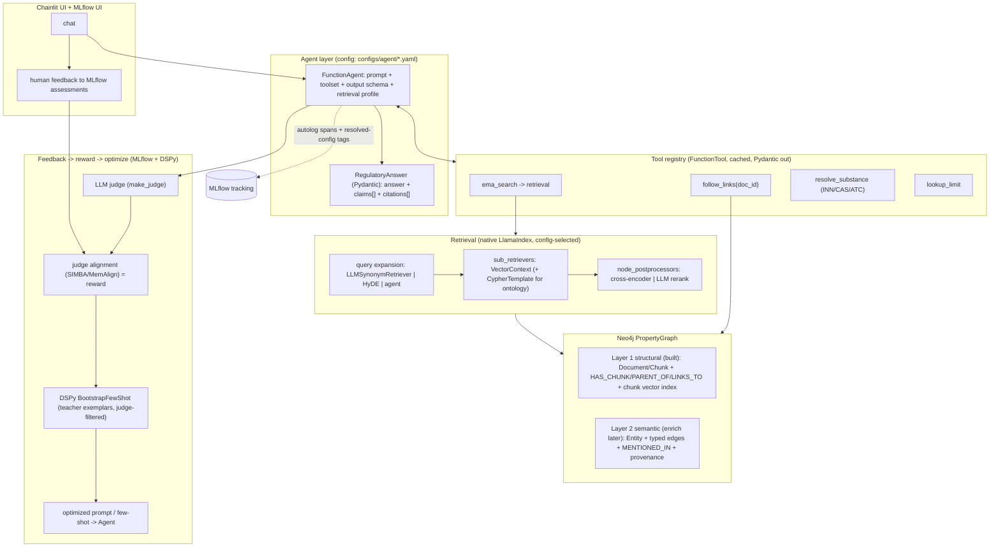
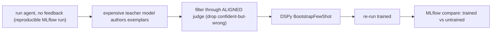

# Target Architecture — Agentic RAG on the EMA Corpus

> **Status: foundation runtime-verified on branch `claude/agentic-rag-foundation` (2026-06-22).**
> The agentic layer described here is **built, unit-tested, and verified end-to-end on the GPU
> host** — `harness/{schemas,tools,agents,retrieval,obs,ontology,eval}/` (PR #46). Verified
> (T1–T6, see [`RUNTIME_VERIFICATION.md`](RUNTIME_VERIFICATION.md)): the agent demo
> (structured `RegulatoryAnswer` + citations), MLflow run-recording **and autolog (traces
> complete — the mlflow#13352 hang did not occur)**, ontology extraction into Neo4j, and
> `mlflow.genai` judges + `evaluate`. The agent is **wired into `app.py` as a selectable
> "Agentic RAG" workflow strategy** (additive — the live Chainlit workflow stack + **Phoenix**
> tracer are untouched; Phoenix still traces every turn, MLflow drives the demo/eval
> entrypoints). **Still deferred** (by design, not blocked): the DSPy bootstrap loop and judge
> *alignment* (need ≥10–100 paired labels, §8) and full-corpus ontology scaling (§4.5). This is
> the agreed target for evolving `ema_nlp` from a *RAG-strategy-comparison harness* into a
> *flexible, self-improving agentic RAG framework* over the EMA corpus.
> **Usage how-to: [`AGENTIC_GUIDE.md`](AGENTIC_GUIDE.md).**
>
> **It deliberately overrides two standing V1 locks, by owner decision:**
> - ontology/graph infrastructure is no longer "deferred to v2" — semantic ontology
>   **edges** are an explicit goal (enriched incrementally, not on day one);
> - orchestration moves to **agentic** (LlamaIndex `FunctionAgent` + tools).
>
> It also accepts that some of this is *anticipatory* (the project's "justify every
> complexity by a benchmark failure" rule is knowingly relaxed) because the primary
> goal is **learning agentic RAG**, with answer quality a close second.
> **No backwards compatibility is required** — components may be renamed/replaced.

---

## 1. Motivation & aims

Build a framework that can:

1. **Orchestrate agents** with a feedback-driven loop that "fine-tunes" the framework to
   the EMA knowledge base (human **and** LLM feedback → reward → optimizer → policy).
2. **Define report/output formats** as first-class **Pydantic** schemas.
3. Be an **agentic framework that uses different tools** to retrieve information.
4. Provide **traceability** of data sources, citations, and reasoning chains.

The observability/eval/judge backbone moves to **MLflow** (chosen for judge alignment;
see §4.6). The retrieval store stays **Neo4j** (`PropertyGraphIndex`).

---

## 2. Decisions locked in this design

| Decision | Choice | Rationale |
|---|---|---|
| Observability + eval + feedback | **MLflow** (Phoenix dropped) | Judge **alignment** (reward signal) has no Phoenix equivalent; one tool for traces + eval + judges |
| Model logging (`log_model`) | **Not used** | Workflows hold injected, non-serializable deps (Neo4j retriever, API LLMs) + state lives in Neo4j; reproducibility comes from MLflow runs/params/artifacts |
| Orchestration | **`FunctionAgent` + `FunctionTool`** (config-driven) | Aim 3; retires the hand-rolled per-step ReAct (~500 lines: `react_native.py`+`events.py`) |
| Output | **Pydantic** answer schema (claims + citations) | Aim 2; also makes the LLM judge far more reliable |
| Retrieval | **Native-first** LlamaIndex (`kg_extractors` / `sub_retrievers` / `node_postprocessors`) | Don't re-hand-roll what the framework/graph store does (the pgvector recursive-CTE regret) |
| Knowledge graph | **Two layers**: structural (built) + semantic ontology (enrich later via an easy button) | Links on now, ontology incrementally |
| Reranking | **Both** cross-encoder + LLM, config-selectable | Owner priority; native postprocessors |
| Query expansion | **Pluggable stage**, agent optional | Owner priority ("specialized expansion agent", config-driven) |
| Transparency | **No silent modes** — resolved config echoed + stamped on every trace | Direct fix for the `mode: none` surprise |

---

## 3. Architecture overview



The agent **is** the orchestration: the former 7 hardcoded workflows collapse into one
config-driven `FunctionAgent` = *(toolset + system prompt + output schema + retrieval
profile)*. CRAG-style "grade/rewrite" becomes query expansion + the agent re-calling
`ema_search`; "review" becomes a judge/scorer pass.

---

## 4. Component design

### 4.1 Agent layer (`harness/agents/`, replaces `harness/workflows/`)

```yaml
# harness/configs/agent/regulatory.yaml
agent:
  model_role: agent                # -> harness/configs/models.yaml
  system_prompt: agent_regulatory.md
  tools: [ema_search, follow_links, resolve_substance, lookup_limit]
  output_schema: RegulatoryAnswer  # Pydantic, enforced
  max_iterations: 6
  retrieval_profile: neo4j_hier
  fewshot: { source: mlflow_rated, k: 3, min_rating: 4 }   # online policy (aim 1)
```

Native `FunctionAgent` + `FunctionTool`. Each tool call is a span (aim 4). Swap
tools/prompt/schema/profile in YAML, never in code. A trivial "retrieve→generate" is a
degenerate agent with only `ema_search` and `max_iterations: 1`.

> **Caveat:** `FunctionAgent` runs on LlamaIndex's Workflow engine, so the MLflow
> autolog "trace stuck In-Progress" bug (mlflow#13352) is in scope — see §4.7 + §8.

### 4.2 Structured output (`harness/schemas/`) — aims 2 & 4

```python
class Citation(BaseModel):
    source_url: str; doc_id: str; chunk_id: str; quote: str

class Claim(BaseModel):
    text: str
    citations: list[Citation]          # claim-level grounding

class RegulatoryAnswer(BaseModel):
    answer: str
    claims: list[Claim]
    citations: list[Citation]
    confidence: float
    caveats: list[str] = []
```

Claim-level citations turn traceability into **output**, not just spans, and let the
faithfulness judge check each claim against its own sources.

### 4.3 Tool registry (`harness/tools/`) — aim 3

`FunctionTool`s, registry-backed, selected per agent in config. Two classes
(see §"tools" discussion): **normalization** (low-risk, sharpen retrieval) and
**content** (allowlisted, cached).

- **Tier 1 (build first):** `resolve_substance` (PubChem/WHO-INN/ATC → `Substance`
  Pydantic), `lookup_limit` (EMA nitrosamine AI table), `follow_links(doc_id)`
  (exposes Layer-1 `LINKS_TO` on demand).
- **Tier 2 (allowlisted, cached):** EMA medicines/EPAR structured fields, ICH guideline
  fetch, Europe PMC. Domain-restricted web search only (ema.europa.eu, ich.org,
  edqm.eu, who.int).
- **Excluded by scope lock:** FDA, DailyMed, clinical-trial sources.

**Reproducibility:** every tool caches its response keyed by call args and snapshots it as
an MLflow artifact, so re-runs replay recorded output (essential for the DSPy
trained-vs-untrained comparison).

### 4.4 Retrieval — **native-first**

Build-time extraction and query-time retrieval use LlamaIndex primitives; the config
just **names native components + params**. The custom surface is intentionally tiny.

| Concern | Native LlamaIndex | Use native? |
|---|---|---|
| Vector seed + neighbor expansion | `VectorContextRetriever` | Yes (but see chunk-index note) |
| Typed ontology queries (Layer 2) | `CypherTemplateRetriever` (preferred) / `TextToCypherRetriever` | Yes — prefer the **template** form |
| Query expansion (cheap default) | `LLMSynonymRetriever`, `HyDEQueryTransform`, `SubQuestionQueryEngine` | Yes |
| Query expansion (heavy) | a tool-using sub-agent | Custom — *one selectable impl* beside the native ones |
| Reranking | `SentenceTransformerRerank` (cross-encoder) + `LLMRerank` (SME rubric as its prompt) | Yes — do not re-hand-roll |
| Ontology extraction | `SchemaLLMPathExtractor` (+ `DynamicLLMPathExtractor`) | Yes |
| NER / IDMP·ATC·CAS linking | custom extractor implementing `TransformComponent`, added to `kg_extractors=[...]` | Native **seam**, custom **logic** (reuses `resolve_substance`) |
| Pipeline composition | `index.as_retriever(sub_retrievers=[...])` + `node_postprocessors=[...]` | Yes — this **is** the pipeline |

```yaml
# extends harness/configs/index/<profile>.yaml
retrieval:
  query_transform: { type: synonym }          # synonym | hyde | agent
  sub_retrievers:
    - { type: chunk_vector, similarity_top_k: 20, merge: true }   # custom (see note)
    - { type: cypher_template, template: typed_limits.cypher }    # native, ontology mode
  node_postprocessors:
    - { type: sentence_transformer_rerank, model: BAAI/bge-reranker-large, top_n: 8 }
build:
  kg_extractors:
    - { type: schema_llm, schema: ema }        # native ontology
    - { type: idmp_linking }                   # custom TransformComponent
```

> **The one justified custom retriever.** The project already ran this spike (HISTORY
> 2026-05-30, LIR-007): the default `VectorContextRetriever` **only searches the
> `__Entity__` index**, so it cannot drive the dedicated `:Chunk` vector index, and it
> does not return the *parent* chunk (small-to-big). Therefore `HierarchicalPGRetriever`
> is **kept** — but reframed as a thin `CustomPGRetriever` subclass (the native extension
> point), so it composes inside `as_retriever(sub_retrievers=[...])` with the native ones.
> This is not "hand-rolling"; it's the sanctioned custom seam, and it's already proven
> necessary. Everything *else* in retrieval is native.

**Reproducibility note:** prefer `CypherTemplateRetriever` over `TextToCypherRetriever`
(free-form Cypher is non-deterministic and an injection surface), and keep the
`sub_retrievers` set minimal — each LLM-backed retriever adds latency/cost per query.

### 4.5 Knowledge graph — two layers

- **Layer 1 — structural (built).** `:Document`/`:Chunk` + `HAS_CHUNK`/`PARENT_OF`/
  `LINKS_TO` (99,520 typed edges) + chunk vector index. **Action: turn on**
  `graph_expand` over `LINKS_TO` across the full corpus — this is a *retrieval-mode flip*,
  not extraction (the edges already exist).
- **Layer 2 — semantic ontology (enrich later).** `:Entity` nodes (typed) + typed
  relations, each `MENTIONED_IN → :Chunk` so semantic hops return **citeable** text.
  Extracted by `SchemaLLMPathExtractor` against a config-defined schema, plus a custom
  IDMP/ATC/CAS linking extractor. **Every edge carries provenance**
  (`source_url`, `chunk_id`, `confidence`).

Curated schema (small on purpose — over-broad schemas wreck extraction precision/cost),
lives in `harness/configs/ontology/ema.yaml`:

| Reasoning | Typed relations |
|---|---|
| Applicability | `APPLIES_TO`, `SUBJECT_TO`, `REQUIRES`, `EXEMPT_FROM` |
| Justification ("because_of", typed) | `MANDATED_BY`, `JUSTIFIED_BY`, `DERIVED_FROM` |
| Causal / risk | `CAUSES`, `CONTRIBUTES_TO`, `MITIGATED_BY`, `ASSESSED_BY` |
| Quantitative | `HAS_LIMIT`, `SETS_LIMIT` |
| Temporal | `SUPERSEDES`, `AMENDS`, `EFFECTIVE_FROM` |
| Cross-reference | `CLARIFIES`, `REFERENCES`, `RELATED_TO` |
| Responsibility | `RESPONSIBLE_FOR`, `ISSUED_BY` |

Entities: `Substance` (incl. impurities; normalized via Tier-1 tools), `Product`,
`Procedure`, `Guideline`, `Committee`, `Requirement`, `Limit`.

**The easy button** (turnkey, idempotent, incremental — just runs native extraction over
a scope and lights up the `ontology` retrieval mode):

```bash
python -m harness.indexing.enrich_ontology --schema ema --scope nitrosamines   # slice first
python -m harness.indexing.enrich_ontology --schema ema --scope all            # when ready
```

### 4.6 Feedback → reward → optimize (MLflow + DSPy) — aim 1



- **Reward = an *aligned* LLM judge.** Define judges with `make_judge` (reuse the
  `harness/judge.py` faithfulness/correctness prompts), collect human + judge assessments
  on the same traces, then `align()` (SIMBA / MemAlign) so the judge agrees with humans.
  Alignment needs ≥10 (50–100 better) paired labels — see §8.
- **Optimizer = DSPy `BootstrapFewShot`**; **policy** = the compiled few-shot/prompt
  injected into the agent (online version: `fewshot.source: mlflow_rated`).
- **Bootstrap plan (owner):** run the agent with no feedback (reproducible MLflow run) →
  an expensive teacher authors the 50–100 exemplars → **filter exemplars through the
  aligned judge** (guardrail against training on plausible-but-wrong) → DSPy compiles →
  re-run → MLflow compares trained vs untrained.

### 4.7 Observability, transparency, reproducibility

- **Tracing:** MLflow `autolog()` for LlamaIndex (Phoenix removed). Fallback if the
  autolog/Workflow trace-completion bug bites: an explicit `mlflow.trace` span at the
  agent entrypoint (the retargeted `WorkflowRunner._stamp_span` pattern).
- **Human feedback:** MLflow assessments/`log_feedback` on traces (replaces the Phoenix
  annotation API).
- **No silent modes:** the *resolved* retrieval/agent config is (1) echoed at start,
  (2) stamped on the root trace as `ema.retrieval.{query_transform,sub_retrievers,
  rerank,graph_mode,k}` + `ema.agent.*` + `ema.ontology.enriched`, (3) shown in the
  Chainlit panel, (4) logged as MLflow params. If a stage is off, the trace says so.
- **Reproducibility:** MLflow run per experiment (params = resolved config; artifacts =
  resolved config + cached tool responses + outputs). `log_model` intentionally unused.

---

## 5. Configuration layout

```
harness/configs/
  agent/<name>.yaml          # toolset + prompt + output_schema + retrieval_profile
  index/<profile>.yaml       # query_transform + sub_retrievers + node_postprocessors + build.kg_extractors
  ontology/ema.yaml          # entity + relation schema (SchemaLLMPathExtractor)
  models.yaml                # roles: agent/grader/expander/reranker/judge/reviewer
harness/
  agents/                    # FunctionAgent builders + registry  (replaces workflows/)
  tools/                     # FunctionTool registry (resolve_substance, follow_links, ...)
  schemas/                   # Pydantic output models
  indexing/                  # kg_extractors (+ idmp_linking), CustomPGRetriever, enrich_ontology
  eval/                      # mlflow.genai judges/scorers + alignment + dspy bootstrap
```

---

## 6. Aim coverage

| Aim | Where it lives |
|---|---|
| 1 — feedback-driven fine-tuning | MLflow judge-alignment (reward) → DSPy (optimizer) → agent few-shot (policy) |
| 2 — Pydantic report formats | `harness/schemas/` enforced as agent `output_schema` |
| 3 — multi-tool agent | `FunctionAgent` + `harness/tools/`, toolset in config |
| 4 — traceability | MLflow spans + structured `claims`/`citations` output + resolved-config stamping |

---

## 7. Build order (each step independently useful)

> **Status (2026-06-22):** steps 1, 2, 4 (judges + `evaluate`), and 5 (ontology extraction)
> are built and runtime-verified; the agent is selectable in `app.py`. Still open: step 3's
> full-corpus `LINKS_TO` graph-expansion measurement + the step-4 DSPy bootstrap/alignment
> loop (needs labelled traces). See §8 and [`RUNTIME_VERIFICATION.md`](RUNTIME_VERIFICATION.md).

1. **Foundation** — Pydantic answer schema + MLflow tracing swap + resolved-config
   stamping (transparency). No agent work yet; unblocks everything.
2. **Agent + Tier-1 tools** — `FunctionAgent` with `ema_search` + `follow_links` +
   `resolve_substance`; retire hand-rolled ReAct.
3. **Retrieval (native)** — compose native `sub_retrievers`/`node_postprocessors`;
   keep `CustomPGRetriever` for the chunk seed; add reranking (both backends);
   turn on `LINKS_TO` expansion across the full corpus; measure.
4. **Eval + judge on MLflow** — `mlflow.genai.evaluate` + judges + alignment; then the
   teacher→DSPy→compare bootstrap.
5. **Ontology Layer 2** — ship `enrich_ontology`; run on the nitrosamine slice; expose
   `mode: ontology` (`CypherTemplateRetriever`). Scale when it earns it.

---

## 8. Spikes / verify before building

- **MLflow autolog on a Workflow-based `FunctionAgent`** — ✅ **RESOLVED (2026-06-22).**
  Autolog traces **complete** (`state=OK`) on mlflow 3.14 + llama-index 0.14; the
  mlflow#13352 "In Progress" hang did not occur. The explicit `traced()` span in
  `harness/obs/tracing.py` is kept as a documented fallback. (Cosmetic: a `MockLLM`-in-the-
  retriever span fails to serialize, non-blocking; lives in the live retriever path.)
- **Span-level human feedback in MLflow** — ⏳ not yet exercised. The live app records
  feedback via **Phoenix annotations** (`app.py`), not MLflow; MLflow per-tool-call
  assessments remain to be wired if/when feedback moves to MLflow.
- **Chunk-vector retriever** — *already settled* (LIR-007): native `VectorContextRetriever`
  can't drive the `:Chunk` index → keep `HierarchicalPGRetriever` as a `CustomPGRetriever`.
- **Judge-alignment data volume** — ⏳ still pending. The judge `.align(...)` API is present
  and verified (`harness/eval/judges.py::align_judge`), but alignment needs ≥10 (50–100
  better) traces with paired human + judge assessments before it is meaningful.

---

## 9. Open decisions

- ~~MLflow autolog vs manual `mlflow.trace` for the agent~~ — **settled (2026-06-22):** autolog
  works (traces complete); `traced()` kept as a fallback. See §8.
- **Phoenix vs MLflow for live tracing** — **current state:** the Chainlit app stays on
  **Phoenix** (the agent runs Phoenix-traced in-app); **MLflow** drives the demo/eval
  entrypoints. The full Phoenix→MLflow migration for the live app is not done and is its own
  decision (the two coexist for now).
- DSPy outputs: committed prompt artifact vs MLflow prompt registry. *(deferred — DSPy loop unrun)*
- Ontology extraction model + cost ceiling when scaling beyond the slice. *(haiku/`grader` works
  with the case fix; opus richer — see [`AGENTIC_GUIDE.md`](AGENTIC_GUIDE.md) §3.)*
- Online few-shot injection vs offline-DSPy-only (run both, or keep online off until DSPy proves out).

---

## 10. References

- LlamaIndex Property Graph — [index guide](https://developers.llamaindex.ai/python/framework/module_guides/indexing/lpg_index_guide/),
  [custom retriever](https://developers.llamaindex.ai/python/examples/property_graph/property_graph_custom_retriever/),
  [path extractors](https://developers.llamaindex.ai/python/examples/property_graph/dynamic_kg_extraction/)
- MLflow — [LLM-as-a-judge](https://mlflow.org/llm-as-a-judge),
  [align judges with humans](https://docs.databricks.com/aws/en/mlflow3/genai/eval-monitor/align-judges),
  [LlamaIndex tracing](https://www.mlflow.org/docs/latest/tracing/integrations/llama_index)
- Internal — [`RETRIEVAL.md`](RETRIEVAL.md), [`RETRIEVAL_TRACKS.md`](RETRIEVAL_TRACKS.md),
  [`WORKFLOWS.md`](WORKFLOWS.md), [`../DECISIONS.md`](../DECISIONS.md)
