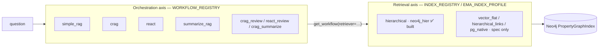

# Strategies & workflows — what exists and how to add your own

> ⛔ **SUPERSEDED / RETIRED (2026-06-25).** This document describes the legacy LlamaIndex
> `Workflow` engine (`harness/workflows/*`: `simple_rag`, `crag`, `react_native`, the
> composites, `WorkflowRunner`, `get_workflow`, the `prompt_strategy` axis) — **that engine was
> deleted.** There is now **one engine** (a `FunctionAgent`) configured by **recipes**; RAG
> techniques are tools + prompt instructions. See [`RECIPES.md`](RECIPES.md) and
> [`RAG_TECHNIQUES.md`](RAG_TECHNIQUES.md). The content below is kept only for historical
> reference and **no longer reflects the codebase**.

This project has **two independent strategy axes**. Keep them separate in your head — the Chainlit config
blob mixes them under one `ema.*` namespace, but they are configured in different places:

| Axis | What it decides | Selected by | Registry |
|------|-----------------|-------------|----------|
| **Orchestration** (`ema.orchestration.strategy` + `prompt_strategy`) | *How the answer is produced* — retrieve→generate, ReAct loop, CRAG grade/rewrite, summarize, review… | `cl.ChatProfile` in `app.py` (and `EMA_WORKFLOW_STRATEGY`); eval YAML `orchestration.strategy` | `WORKFLOW_REGISTRY` in `harness/workflows/registry.py` |
| **Retrieval** (`ema.retrieval.strategy` + `ema.index.profile`) | *How documents are fetched* — vector seed, small-to-big merge, graph expansion… | `EMA_INDEX_PROFILE` → `harness/configs/index/<name>.yaml` | `INDEX_REGISTRY` / `RETRIEVER_REGISTRY` in `harness/indexing/registry.py` |

A workflow **consumes** a retriever (`get_workflow(name, retriever=…, llm=…)`). You can mix any workflow
with any retrieval profile.



> Note: "RecursiveRetriever" is **not** a strategy in this project. LlamaIndex ships one, but retrieval here
> uses the custom `HierarchicalPGRetriever`. The planned graph-walking retrievers are `hierarchical_links`
> and `property_graph_native` (spec only — see [`RETRIEVAL_TRACKS.md`](RETRIEVAL_TRACKS.md)).

> **Agentic layer (runtime-verified, branch `claude/agentic-rag-foundation`):** a
> `FunctionAgent` + tool-registry orchestration (`harness/agents/`, `harness/tools/`) with a
> config-driven retrieval pipeline (`harness/retrieval/`, query-expansion + rerank) is wired
> **additively** as the **`agent`** strategy in `WORKFLOW_REGISTRY` (via
> `harness/agents/workflow_adapter.py`), so it appears as the **"Agentic RAG"** option in the
> Chainlit panel alongside the workflows below — it does not replace them. How-to:
> [`AGENTIC_GUIDE.md`](AGENTIC_GUIDE.md); design: [`TARGET_ARCHITECTURE.md`](TARGET_ARCHITECTURE.md).
>
> **Tracing backend:** the live workflows + `app.py` (including the in-app `agent` strategy) are
> traced by **MLflow** (`mlflow.llama_index.autolog()` + a per-turn `harness.obs.tracing.traced`
> span) — that is what the "trace span per step" above is captured by. 👍/👎 feedback is written as
> MLflow trace assessments. The same MLflow autolog also powers the agentic layer's demo/eval
> entrypoints (run-recording, `mlflow.genai` judges). `run_ui.sh` starts the MLflow tracking server
> on :5000.

---

## What's implemented today

Check live at any time:

```bash
python -m harness.workflows.registry --list          # orchestration workflows
python -c "import harness.indexing as h; print(h.list_index_kinds(), h.list_retriever_strategies())"
```

### Orchestration workflows (7)

| Strategy | Shape | Accepts `prompt_strategy`? |
|----------|-------|----------------------------|
| `simple_rag` | retrieve → generate | ✅ |
| `crag` | retrieve → grade ⇄ rewrite → generate | ✅ |
| `summarize_rag` | retrieve → summarize → generate | ✅ |
| `crag_summarize` | CRAG loop → summarize → generate | ✅ |
| `crag_review` | CRAG loop → generate → reviewer | ✅ |
| `react` | native ReAct (think/act/observe/finish, one trace span per step) | ❌ (fixed `react_native`) |
| `react_review` | ReAct → reviewer (score only) | ❌ |

### Prompt strategies (3)

`zero_shot`, `few_shot`, `cot_self` — files in `harness/prompts/` (`_PROMPT_FILES` in
`harness/workflows/utils.py`). They tune the answer-generation prompt of the workflows marked ✅ above.
The Chainlit UI flattens *workflow × prompt* into **9 profiles** (`_PROFILE_STRATEGY` in `app.py`).

### Retrieval strategies (1 built)

| Strategy | Index kind | Profile | Status |
|----------|-----------|---------|--------|
| `hierarchical` | `property_graph` (Neo4j) | `neo4j_hier` | ✅ built |
| `vector` (`vector_flat`) | `vector_flat` | — | spec only |
| `hierarchical_links` | `property_graph` | — | spec only |
| `pg_native` (`property_graph_native`) | `property_graph_native` | — | spec only |

The spec-only ones live in [`RETRIEVAL_TRACKS.md`](RETRIEVAL_TRACKS.md).

---

## The orchestration contract (read this before adding a workflow)

Every workflow is a LlamaIndex `Workflow` wrapped in a `WorkflowRunner`. The contract:

- **Construction:** a `build_<name>(*, retriever, llm, **kwargs) -> WorkflowRunner` factory.
- **Inputs** (the `StartEvent` dict that `WorkflowRunner.invoke/ainvoke` forwards):
  `question` (str), `few_shot_context` (str, optional), `run_id` (str), `source` (str).
- **Output dict:** must include `answer_text` (str) and `docs` (list of `TextNode` with
  `metadata.source_url`/`doc_id`/`score`). Extra keys are fine (e.g. `prompt_strategy`, `summary`).
- **Tracing:** implement `config_attributes() -> dict[str, str|int|float|bool]` returning the `ema.*` span
  keys (`WorkflowRunner._stamp_span` calls it and adds `ema.run.id`/`ema.run.source`/`ema.index.profile`).
  Reuse `retriever_attributes(self._retriever)` for the `ema.retrieval.*` keys.
- **Helpers** (`harness/workflows/utils.py`): `nodes_from_retrieval`, `format_docs`, `build_rag_messages`,
  `load_system_prompt`, `extract_answer`.

`SimpleRAGWorkflow` (`harness/workflows/simple_rag.py`) is the canonical 40-line example — copy it.

---

## Recipe A — add a custom orchestration workflow

Goal: a new strategy `my_strategy` selectable everywhere (`get_workflow`, eval YAML, the Chainlit UI).

**1. Implement the workflow** in `harness/workflows/my_strategy.py`:

```python
from typing import Any
from llama_index.core.workflow import Context, StartEvent, StopEvent, Workflow, step
from harness.workflows.utils import (
    WorkflowRunner, build_rag_messages, extract_answer, format_docs,
    load_system_prompt, nodes_from_retrieval, retriever_attributes,
)

class MyStrategyWorkflow(Workflow):
    def __init__(self, *, retriever: Any, llm: Any, prompt_strategy: str = "zero_shot", **kw: Any) -> None:
        super().__init__(**kw)
        self._retriever = retriever
        self._llm = llm
        self._prompt_strategy = prompt_strategy
        self._system_prompt = load_system_prompt(prompt_strategy)

    def config_attributes(self) -> dict:
        return {
            "ema.orchestration.strategy": "my_strategy",
            "ema.orchestration.prompt_strategy": self._prompt_strategy,
            **retriever_attributes(self._retriever),
        }

    @step
    async def run(self, ctx: Context, ev: StartEvent) -> StopEvent:
        question = ev.get("question", "")
        docs = nodes_from_retrieval(await self._retriever.aretrieve(question))
        # ... your orchestration: extra LLM calls, tool loops, multiple @step methods ...
        messages = build_rag_messages(self._system_prompt, format_docs(docs), question,
                                      ev.get("few_shot_context", ""))
        raw = (await self._llm.achat(messages)).message.content or ""
        return StopEvent(result={
            "answer_text": extract_answer(raw, self._prompt_strategy),
            "docs": docs,
            "prompt_strategy": self._prompt_strategy,
        })

def build_my_strategy(*, retriever: Any, llm: Any, prompt_strategy: str = "zero_shot") -> WorkflowRunner:
    return WorkflowRunner(MyStrategyWorkflow(retriever=retriever, llm=llm,
                                             prompt_strategy=prompt_strategy, timeout=120))
```

> For multi-step agents (per-step trace spans for HITL labeling), model each action as its own `@step`
> with custom events — see `harness/workflows/react_native.py` and `harness/workflows/events.py`.

**2. Register it** in `harness/workflows/registry.py`:

```python
def _build_my_strategy(retriever, llm, **kw):
    from harness.workflows.my_strategy import build_my_strategy
    return build_my_strategy(retriever=retriever, llm=llm, **kw)

WORKFLOW_REGISTRY["my_strategy"] = _build_my_strategy   # add to the dict literal
```

That is the only wiring `get_workflow` / eval YAML need. Verify:
`python -m harness.workflows.registry --list` shows `my_strategy`.

**3. (Optional) compose existing workflows** instead of writing from scratch — `harness/workflows/composites.py`
shows `crag_review` / `react_review` chaining a base workflow + a `review` pass. Mirror that pattern.

**4. Nothing to do for the Chainlit UI** — the settings panel lists workflows **dynamically** from
`list_workflows()`, so `my_strategy` appears in the live **Workflow** dropdown automatically (with a
title-cased label; add a friendly one to `_WORKFLOW_LABELS` in `app.py` if you like). The only contract: a
registered builder must be callable from `(retriever, llm[, prompt_strategy])` alone. (The pre-chat
`cl.ChatProfile` list still uses `_PROFILE_STRATEGY` as a seed; adding an entry there is optional.)

**5. (Optional) use it in eval configs:** `orchestration: { strategy: my_strategy, prompt_strategy: cot_self }`.

**No backward-compat aliases** — registry keys are renamed/added directly (project convention, see
`DECISIONS.md`).

---

## Recipe B — add a custom prompt strategy (no new workflow)

The prompt variant is decoupled from the workflow (see `DECISIONS.md` — "prompt_strategy as YAML field").
To add e.g. `self_consistency`:

1. Add `harness/prompts/system_self_consistency.md`.
2. Add `"self_consistency": "system_self_consistency.md"` to `_PROMPT_FILES` (`harness/workflows/utils.py`).
3. Add `"self_consistency"` to each workflow's `_VALID_STRATEGIES` guard (e.g. `simple_rag.py`).
4. If it needs output post-processing (like `cot_self`'s `<reasoning>` stripping), extend `extract_answer`.

No registry or builder changes.

---

## Recipe C — add a custom retrieval strategy (the other axis)

Retrieval is the separate `harness/indexing` seam. Summary (full details in
[`RETRIEVAL.md`](RETRIEVAL.md) §7 and [`RETRIEVAL_TRACKS.md`](RETRIEVAL_TRACKS.md)):

1. Write a builder and register it:
   ```python
   from harness.indexing.registry import register_index, register_retriever

   @register_index("my_kind")
   def build_my_index(profile, **kw): ...

   @register_retriever("my_retriever")
   def build_my_retriever(profile, index, **kw): ...   # returns a BaseRetriever
   ```
2. Import the module in `harness/indexing/__init__.py` so the decorators run.
3. Add a profile `harness/configs/index/<name>.yaml` with `index.kind: my_kind` /
   `retrieval.strategy: my_retriever`.
4. Select it with `EMA_INDEX_PROFILE=<name>`.

The retriever must stamp `source_url`/`doc_id` on returned `TextNode.metadata` (the citation + benchmark
contract). The workflow layer is unaware of the retriever's internals — any registered retriever drops into
any workflow.

> **Caveat (P0):** `app.py` and the workflows currently `open_index` via the `property_graph`-specific
> function. A non-`property_graph` retrieval kind needs the registry-level `open` dispatch described in
> `RETRIEVAL_TRACKS.md` §0.7 before it is selectable from the UI.

---

## Where each piece lives

```
harness/workflows/
  registry.py      WORKFLOW_REGISTRY + get_workflow + list_workflows        (orchestration seam)
  simple_rag.py    canonical retrieve→generate workflow (copy this)
  crag.py          grade ⇄ rewrite loop
  summarize_rag.py retrieve → summarize → generate
  react_native.py  per-@step ReAct (one trace span per action) + events.py
  composites.py    crag_summarize / crag_review / react_review (chaining pattern)
  review.py        reviewer pass used by *_review composites
  utils.py         WorkflowRunner, load_system_prompt, _PROMPT_FILES, format/extract helpers
harness/prompts/   system_{zero_shot,few_shot_sme,cot_self}.md
harness/indexing/  registry.py / profiles.py / property_graph.py + configs/index/*.yaml  (retrieval seam)
app.py             _PROFILE_STRATEGY, _make_chat_settings, _build_session_workflow        (Chainlit wiring)
```

See also: [`RETRIEVAL.md`](RETRIEVAL.md) (retrieval store + retriever), [`RETRIEVAL_TRACKS.md`](RETRIEVAL_TRACKS.md)
(planned retrieval strategies), [`ARCHITECTURE.md`](ARCHITECTURE.md), [`../DECISIONS.md`](../DECISIONS.md)
(why the registry/prompt seams are shaped this way).
