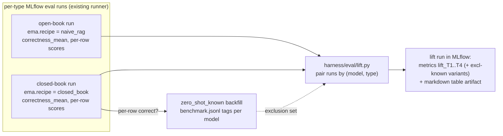

# Plan: closed-book baseline + the lift metric

*Status: 📋 planned (2026-07-08). Everything it builds on is live and runtime-verified
(GPU walk, `RUNTIME_VERIFICATION.md` §8).*

## 1. Why this is the headline number

EMA content is old, public, and almost certainly in every frontier model's training data.
So an absolute score like *"naive_rag gets correctness 4.0 on T1"* is uninterpretable: did
retrieval help, or did the model already know the answer from pretraining?

**Lift** answers that by subtracting what the model can do *without* retrieval:

```
lift(recipe, model, type) = score(open-book: recipe with retrieval)
                          − score(closed-book: same model, same questions, NO retrieval)
```

A model that memorized the corpus scores high closed-book → low lift → honest signal that
retrieval added little. A question type where retrieval genuinely helps shows high lift.
This framing (from `project_roadmap/LEAKAGE.md`) makes results robust to contamination
*without* needing to prove what's in anyone's training data — and the closed-book run
itself doubles as the **Phase 2.5 contamination screen**: any question a model answers
correctly with no context gets flagged `zero_shot_known` in the benchmark, and results are
reported with and without those items.

Worked example of the target output:

| Type | closed-book acc. | naive_rag acc. | **lift** | lift (excl. zero-shot-known) |
|---|---|---|---|---|
| T1 (n=20) | 0.55 | 0.90 | **+0.35** | +0.42 (n=9) |
| T3 (n=10) | 0.20 | 0.70 | **+0.50** | +0.50 (n=8) |

## 2. What already exists (nothing here starts from scratch)

| Piece | Where | State |
|---|---|---|
| Recipe × benchmark runner: per-type MLflow runs, tagged `ema.recipe`/`ema.benchmark`/`ema.question_type` | `harness/eval/runner.py`, `scripts/run_eval.py` | ✅ live-verified (W2: `T1: correctness_mean=4.000`) |
| Correctness judge (1–5 vs `gold_answer`) + faithfulness judge | `harness/eval/judges.py`, prompts in `harness/judges/` | ✅ live-verified |
| Per-judge mean aggregation onto the run (`correctness_mean`, …) | `runner.py:mean_scores/_aggregate_run_metrics` | ✅ |
| Benchmark rows with `bench_id`, `type`, `gold_answer`, and an **empty `zero_shot_known` field waiting to be filled** | `benchmark/benchmark.jsonl` (45 items) | ✅ |
| One composition path for any "recipe" incl. degenerate ones; honest trace stamping | `harness/recipes/` | ✅ |
| MLflow as the system of record for results (R6-Q1 decision) | — | ✅ |

The whole plan is therefore: **one new recipe, two small runner extensions, one new
comparison module, one backfill script.**

## 3. Design



### 3a. The closed-book baseline is just another recipe

```yaml
# harness/configs/recipes/closed_book.yaml
recipe:
  label: "Closed-book baseline (no retrieval)"
  description: "Answers from model knowledge only — the lift denominator. Not for chat use."
  orchestration:
    system_prompt: agent_closed_book.md   # "answer from your own knowledge; no citations;
    tools: []                             #  say 'I don't know' rather than guess"
    output_schema: RegulatoryAnswer       # same schema → same judge plumbing (citations stay empty)
  retrieval:
    index_profile: neo4j_hier             # loaded but never queried (no tools) — see §5 note
  generation:
    model: claude_opus
    temperature: 0.0
```

Why a recipe rather than a bare LLM call: it reuses the **single composition path**
(`build_recipe` → adapter → `build_predict_fn` → evaluate), gets the same honest trace
stamping (`ema.orchestration.tools=[]` — visibly retrieval-free), and the `--model`
override already works, so closed-book runs per model tier come for free.

### 3b. Runner extensions (small)

- **Judge selection**: `run_recipe_benchmark(..., judges=("faithfulness", "correctness"))`
  → closed-book runs pass `judges=("correctness",)` (faithfulness is meaningless with no
  retrieved context). `ema_judges` already builds per-name; this is parameter plumbing.
- **Model tag**: stamp `ema.model` (the effective model) on eval runs so lift pairing is
  `(model, question_type)` — today only the recipe is tagged.
- **CLI**: `scripts/run_eval.py --recipe closed_book` already works once the recipe
  exists; add `--judges` passthrough.

### 3c. Score → "correct": binarization

The correctness judge returns 1–5. Lift needs a per-question **correct/incorrect**:

- **Primary metric: accuracy@4** — a question counts as answered iff correctness ≥ 4
  ("mostly/fully correct" per the rubric). Fractions are interpretable and robust to
  judge-scale drift.
- **Also reported**: mean-score delta (`correctness_mean_open − correctness_mean_closed`)
  as a secondary, finer-grained view.
- Both computed from the **per-row assessments** already attached to each run's traces
  (the same data `mean_scores` reads).

### 3d. `harness/eval/lift.py` — the comparison module

- `collect_run_scores(run_id) -> {question: score}` — per-row correctness from the run's
  linked traces (question text keys the row; benchmark questions are unique).
- `compute_lift(open_scores, closed_scores, *, threshold=4.0, exclude=set()) ->
  LiftResult` — pure, tested: per-type accuracy@threshold for both arms, deltas, counts,
  and the excl-`zero_shot_known` variant.
- `run_lift(recipe, *, model, experiment) -> mlflow run` — finds the newest matching
  open/closed run pair per type (tags `ema.recipe`/`ema.model`/`ema.question_type`),
  computes lift, and records **one MLflow "lift" run**: metrics
  `lift_T1..lift_T4`, `lift_T1_excl_known…`, `closed_acc_T*`, `open_acc_T*`; tags
  `ema.lift.open_run_id` / `ema.lift.closed_run_id` (provenance); artifact
  `lift_report.md` (the table above, ready to paste).
- CLI: `scripts/run_lift.py --recipe naive_rag [--model claude_opus]`, printing the table.

### 3e. `zero_shot_known` backfill (the contamination screen)

`scripts/backfill_zero_shot_known.py --closed-run <run_id> --model claude_opus`:
reads the closed-book run's per-row scores, sets
`zero_shot_known["claude_opus"] = score >= 4` per benchmark item (matched by question
text), and rewrites `benchmark/benchmark.jsonl` in place (git-diffable — the review is the
diff). `lift.py` reads the same field for the exclusion variant, so screen and metric
never disagree.

## 4. Implementation steps (≈ 1–1.5 days)

1. `agent_closed_book.md` prompt + `closed_book.yaml` recipe (+ registry test asserting
   `tools == []` builds). *(~0.5 h — riskiest unknown is `FunctionAgent` with zero tools;
   see §5.)*
2. Runner: `judges=` param, `ema.model` run tag, `--judges` CLI. Tests. *(~1 h)*
3. `harness/eval/lift.py` (pure computation + MLflow pairing/recording) + `scripts/run_lift.py`.
   Offline tests for `compute_lift` (thresholds, exclusions, missing types, empty arms). *(~3 h)*
4. `backfill_zero_shot_known.py` + test on a copied benchmark file. *(~1 h)*
5. GPU runs: closed-book full 45 questions, open-book `naive_rag` full 45, backfill,
   `run_lift` → first real lift table. Record in `RUNTIME_VERIFICATION.md`. *(~1 h wall)*
6. Docs: how-to lands in `docs/ONBOARDING.md` §9 + a short `docs/` section; decisions
   (binarization threshold, pairing rule) → `DECISIONS.md`; this plan gets the "landed"
   banner. *(~0.5 h)*

## 5. Open decisions & risks

- **`FunctionAgent` with zero tools** — must verify the installed llama-index runs a
  no-tool agent cleanly (it should: the structured-output step is tool-independent since
  the 2026-07-07 wrapper fix). Fallback: a `noop` tool it's told never to call, or a
  plain-LLM predict path — decide only if the clean way fails.
- **Threshold** for "correct" (proposed: ≥ 4). Alternative: judge-prompted binary verdict.
  Start with ≥ 4; it's a parameter everywhere.
- **Index profile in the closed-book recipe** — `build_recipe` currently requires an
  opened index even though no tool uses it. Acceptable for v1 (the GPU host has it);
  a later nicety could make the index lazy for tool-less recipes.
- **Statistics** — n=45 (per-type n as low as 5): report raw counts alongside fractions;
  bootstrap CIs are a later refinement, not v1.
- **Slot-guessing test** (mask a numeric limit, ask the model to fill it) — the deeper
  memorization probe from `LEAKAGE.md`; deliberately out of scope here, candidate for a
  follow-up plan.
- **OLMo tier** — `olmo_32b` (Together) is configured but unverified; the lift pipeline is
  model-agnostic, so adding tiers is a `--model` flag once the provider path is checked.

## 6. Verification

Offline: unit tests for `compute_lift` (hand-built score dicts covering thresholds,
exclusions, per-type math), backfill on a fixture file, runner `judges=` plumbing.
Runtime (GPU host): step 5 above end-to-end; sanity-expect T1 lift noticeably lower than
T3/T4 lift (lookups are the most memorizable), and every `zero_shot_known` flag visible in
the benchmark diff.
