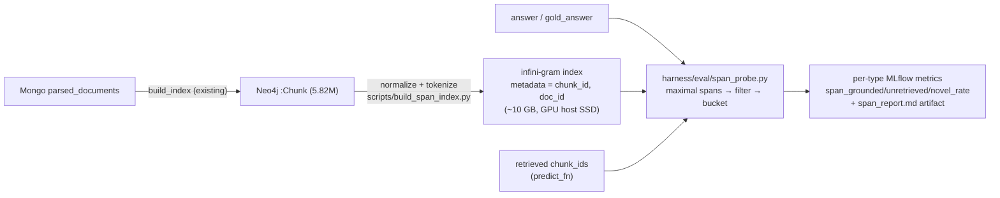

# Plan: retrieval-miss detection via exact-span search (infini-gram)

*Status: 💡 designed (2026-07-12) — **build gated on a trigger condition in §5**, per the
"complexity must be justified by a benchmark failure" rule. Design is execution-ready.*

## 1. Why

The attribution layer (`harness/attribution.py`) can only reason about the passages that
were retrieved *this turn*. It is blind to the complement case: **the answer contains text
that exists verbatim somewhere in the 80k-document corpus, but that document was never
retrieved.** An exact-span index over the corpus closes that blind spot, borrowing
OLMoTrace's mechanism (maximal matching spans over an infini-gram suffix-array index,
arXiv 2504.07096) but pointing it at the *retrieval corpus* instead of training data.

Every distinctive answer span then falls into one of three buckets:

| Bucket | Meaning |
|---|---|
| **grounded** — in a retrieved chunk | attribution.py's home turf; all good |
| **unretrieved** — in the corpus, but not retrieved | retrieval miss *or* parametric leakage — the diagnostic gold |
| **novel** — nowhere in the corpus | the model's own words (fine for T4 synthesis, suspicious for T1 lookup) |

Three uses, in priority order:

1. **Eval triage** — separates retrieval failure from generation failure. When a T3
   multi-hop item fails, today we cannot tell whether the graph walk underfetched or the
   synthesis went wrong. Probing the *gold answer's* spans gives a judge-free
   retrieval-recall measurement; probing the *model answer's* spans shows where its
   phrasing actually came from.
2. **Memorization signature** — complements [`closed_book_lift.md`](closed_book_lift.md).
   On **closed-book** runs there is no retrieval, so *any* verbatim corpus match is
   parametric memory — a mechanical companion signal to the judge-based
   `zero_shot_known` screen. On open-book runs, a high unretrieved rate decomposes a weak
   lift number: "retrieval added little" vs. "closed-book was already contaminated".
3. **Citation repair (later, live)** — an `unmatched_claims` entry or an SME "✗ no
   support" verdict can be searched against the corpus; hits are candidate correct
   sources ("suggested source" in the CitationReview element) and evidence for tuning
   `doc_type_priority` ("the phrasing comes from a guideline, we cited an EPAR").

**Honest limitation:** this is a one-sided detector. Exact matching has near-perfect
precision ("this text literally exists in chunk C") and zero recall for paraphrase — a
low unretrieved rate proves nothing. It *complements* the faithfulness judges; it never
replaces them.

## 2. What already exists

| Piece | Where | Relevance |
|---|---|---|
| Normalization with offset map (casefold + whitespace-collapse) | `harness/attribution.py::_normalize` | reuse for corpus + answer text (extract to a shared helper) |
| Leaf chunk text + `chunk_id` provenance | Neo4j `:Chunk` nodes (5.82M leaves); surfaced by `HierarchicalPGRetriever` | the indexable unit and the join key |
| Eval runner with per-type MLflow runs + retrieved passages per row | `harness/eval/runner.py`, `predict.py` (`context_passages`) | integration seam — needs `context_chunk_ids` added (§3d) |
| Benchmark rows with `gold_answer` | `benchmark/benchmark.jsonl` | gold-span probing (use 1) |
| `infini-gram` pip package (v2.6.0, 2025-05): custom-index build, `find()`, `count()`, `get_doc_by_*()` w/ per-doc metadata; Linux x86_64, CPython ≥3.11 | [pypi](https://pypi.org/project/infini-gram/), [docs](https://infini-gram.readthedocs.io/) | the search primitive — **no** `attribute()`/maximal-span method ships in the package |
| OLMoTrace span algorithm + filtering, Apache 2.0 | [allenai/infinigram-api](https://github.com/allenai/infinigram-api) | reference implementation to port, not a dependency |

**Alternative considered and set aside:** a Lucene full-text index on `:Chunk.text` in
Neo4j with shingle phrase-queries — no new artifact, but only approximate maximality
(fixed shingles), no cheap corpus-frequency stats, ~10s of ms per phrase query (marginal
for live use), and extra heap pressure on the container already holding 5.8M embeddings.
infini-gram gives true maximal spans, `count()`-based distinctiveness filtering for free,
and sub-ms queries that keep the live citation-repair path (use 3) open. If the build
trigger fires but 2–3 days feels too big, the Lucene variant is the acknowledged fallback
prototype.

## 3. Design

### 3a. Index build — `scripts/build_span_index.py`

- **Unit = leaf chunk.** Stream leaf `:Chunk` texts + `chunk_id`/`doc_id` from Neo4j (the
  same nodes retrieval returns, so bucket membership is a plain set intersection — no
  corpus-side offset map needed; we only need *which chunk* matched, not *where*).
- **Normalize before tokenizing** — this is the sneaky-hard part. Corpus text is
  pymupdf4llm markdown (`**bold**`, hard line-wraps mid-sentence, table pipes); answers
  are clean prose. Naive indexing kills verbatim matches. Extract
  `attribution._normalize` into a shared `harness/textnorm.py`, extend it to strip
  markdown decoration, and apply the *same* function to corpus chunks and answers.
- **Tokenizer:** any public one used consistently on both sides (proposal: Llama-2 via
  HF, the package's most-tested path). Claude's tokenizer being unavailable is
  irrelevant — only internal consistency matters.
- Output: one infini-gram index dir (suffix array over ~1B tokens ≈ 10 GB, SSD on the
  GPU host), rebuilt whenever the Neo4j index is rebuilt (stamp the build with the
  ingest snapshot date to detect drift).

### 3b. Span search + filtering — `harness/eval/span_probe.py`

Hand-built on the package's `find()` (the OLMoTrace algorithm is **not** in the package —
port from infinigram-api):

1. **Maximal spans:** for each suffix position of the (normalized, tokenized) answer,
   binary-search the longest prefix with `find()` count > 0; keep spans not contained in
   a longer match. At ~500-token answers a serial loop is fast enough; no parallelism.
2. **Filters** (the quality lives here, per the paper):
   - *self-containment* — no sentence boundary mid-span, whole words at the edges;
   - *distinctiveness* — drop spans matching more than `max_df` chunks (via the same
     `find()` count) **and** rank the rest by span unigram probability (token unigram
     counts via `count()`), keeping the top `K = ceil(0.05 · L)` — OLMoTrace found
     length-ranking strictly worse;
   - *min length* ≥ 8 tokens.
   - The EMA template boilerplate ("marketing authorisation holder…") is exactly what
     `max_df` exists for; expect this to be the tuned parameter.
3. **Bucketing:** map surviving spans → matching `chunk_id`s (`get_doc_by_rank`
   metadata) → intersect with the turn's retrieved `chunk_id`s → `grounded` /
   `unretrieved` / `novel`. Pure function, engine injected — offline-testable with a
   fake engine.

### 3c. Metrics + report

Per eval run (i.e., per question type, matching the existing runner granularity):
`span_grounded_rate`, `span_unretrieved_rate`, `span_novel_rate` (span-count weighted),
plus a `span_report.md` artifact listing the top unretrieved spans with their source
document title/category and the question they came from — the human-readable triage
surface. Closed-book runs report the same numbers; there `unretrieved + grounded ≡
in-corpus` is the memorization signal.

### 3d. Runner integration (small)

- `predict.py::_prediction` additionally returns `context_chunk_ids` (available on the
  captured nodes / adapter docs — today only passage *strings* survive).
- `run_recipe_benchmark(..., span_probe=False)` flag + `scripts/run_eval.py
  --span-probe`: after judging, run the probe per row, log metrics + artifact on the
  same MLflow run. Zero cost when off; index-missing degrades to a logged warning, never
  a failed eval.

## 4. Implementation steps (≈ 2–3 days, GPU host for 4–6)

1. Extract shared normalizer to `harness/textnorm.py` (attribution.py keeps behavior —
   pure refactor + existing 14 tests stay green). *(~1 h)*
2. `span_probe.py`: maximal-span search + filters + bucketing against a fake engine;
   offline tests with a hand-built toy corpus. *(~4 h)*
3. `build_span_index.py`: Neo4j stream → normalize → tokenize → package indexing CLI;
   metadata plumbing; smoke-test on the CPU verify subset
   (`backfill_parsed_documents_subset.py` world). *(~3 h)*
4. Runner integration (`context_chunk_ids`, `--span-probe`, metrics/artifact). *(~2 h)*
5. GPU: full index build; probe a completed eval run's answers; hand-check ~10
   unretrieved spans and tune `max_df` / `K` until the report reads as signal, not
   boilerplate. Record in `RUNTIME_VERIFICATION.md`. *(~half day incl. build)*
6. Docs: how-to → `docs/RETRIEVAL.md` or a short `docs/` section; parameter decisions →
   `DECISIONS.md`; this plan gets the landed banner. *(~0.5 h)*

## 5. Build triggers, open decisions & risks

**Build when one of these is actually observed** (not before):

- eval answers are *correct but faithfulness is low*, or `unmatched_claims` rates are
  high — need to know: retrieval missing, or the model free-styling from memory?
- the lift number (once `closed_book_lift.md` lands) is near zero and needs decomposing
  into "retrieval adds nothing" vs. "closed-book already contaminated";
- SME review accumulates "✗ no support" verdicts and citation-repair suggestions (use 3)
  become worth having live.

Open decisions & risks:

- **Boilerplate dominance** — the main empirical risk: EMA's templated prose may leave
  few distinctive spans after filtering. Mitigation is step 5's hand-check; cheap
  pre-flight before committing to the build: grep a handful of eval answers' 8-grams
  against Mongo to eyeball the signal.
- **Paraphrase blindness** (inherent) — report the probe only ever alongside judge
  metrics; never as a standalone groundedness score.
- **Index staleness** — a second artifact derived from the same corpus as Neo4j; stamp
  and check the ingest snapshot at probe time, warn on mismatch.
- **Dependency maturity** — research-grade package (C++ ext, CPython ≥3.11, Linux ok).
  Engine access is isolated behind `span_probe.py`'s injected-engine seam, so a swap
  (or the Lucene fallback) never touches callers.
- **Gold-answer probing** (use 1's judge-free recall) — same machinery, but gold answers
  are human-written and may share no verbatim spans with the corpus; treat as a bonus
  measurement, decide after seeing step 5 numbers.
- **Live per-turn path** (use 3) — deliberately out of scope for v1; the sub-ms query
  budget keeps it open.

## 6. Verification

Offline: unit tests for maximal-span search, each filter, and bucketing over a fake
engine + toy corpus (incl. markdown-normalization round-trips: `**bold**`/line-wrapped
corpus text must match clean prose). Runtime (GPU): step 5 — index build over the full
corpus, probe over a real eval run, hand-check of the `span_report.md` spans (each
unretrieved span must actually exist in its claimed source document — spot-check in
Mongo), and a closed-book run showing a plausibly *higher* in-corpus rate on T1 than T4.
